# AME MAC Dataformat and MAC workloads profile v0.14_1 — Proposals

> - Author : KyuTae Ahn (trustfarm.info@gmail.com , cpplover@trustfarm.net) 
> - Licenses : 
>      - Apache2.0, CC BY 4.0, 
>      - Additionally licensed under MIT for use in RISC-V, OpenRISC, and OSS TPU platforms
> - History : 
>   - Sep.19, 2025 Scaling tile MAC pseudocode view of SoC design profile V0.15
>   - Sep.18, 2025 Refinement of Dataformat view of SoC design profile V0.13
>   - Sep.18, 2025 AME MAC procedure and Dataformat profile V0.12
>   - Sep.15, 2025 AME Dataformat draft profile v0.1

---

## 1. **Signature**
```
C = MAC(A, B, K, M, bTR, bOVF, Ft)
```
- `A`, `B`: input **tile IDs** (from unified tile register file, 32 tiles total)
- `K`: number of elements **per row** in a tile (depends on element size)
- `M`: number of **rows** in a tile (default 16)
- `bTR`: **Transpose** of A or B (default 00b, 10b: AᵀxB, 01b:A×Bᵀ, 11b: Aᵀ×Bᵀ )  
- `bOVF`: overflow behavior for integer accumulate  
  - `1`: **Overflow ignore** (wrap/clip by implementation) → enables **INT8→INT8** or **FP8->FP8** path  
  - `0`: **Full accumulate** (default) → enables **INT8→INT16** or **FP8->FP16**path
- `Ft`: **Input FormatType** (8-bit code) — selects operand formats (INT8/FP8 types, etc.) and the implied accumulator/output

> For floating point, FP8 accumulates to **FP16**. For integer, **INT8** accumulates to **INT16** when `bOVF=0` and to **INT8** when `bOVF=1` (overflow ignored).


---

## 2. Legend
- **INT** = signed integer; **UINT** = unsigned integer  
- **FP** = floating point (IEEE-like unless noted)  
- **UF** = unsigned floating microscaling (uExMy)  
- **E\*M\*** = exponent/mantissa bit split (sign bit implied where 's' is used)  
- **Qm.n** = fixed-point with *m* integer bits, *n* fractional bits

---

> Scope: refresh **profiles/tables** to match AME MAC policy  
> INT8×INT8 → **INT16** (full) / **INT8** (overflow‑ignore), FP8(E4M3/E5M2) → **FP16**, FP16/BF16 → **FP32**.  
> Base compute cell: **4×4 tile** (16×16 elements per tile at 8b). Guarded 4×4 only when `out_width≤16` and `result_tiles≤32`.

---

## 3. AME Dataformat Profile (includes element-wise view by RV Profile)

| level | Common (must)            | HPC_baseline                | HPC_main                     | HPC_vns (VNS**)        | HPC_nte (NTE**) |
|------:|--------------------------|-----------------------------|------------------------------|------------------|---------------------|
| 1     | **INT8→INT8**, **FP8→FP8** (bOVF=1) |  **INT8->INT16**   ,    **FP8→FP16** , **INT16->INT16** , **FP16->FP16**  (bOVF=1)  | **BF16->BF16** (bOVF=1) , **BF16->FP32**  , **INT16→INT32** | **E8M8→FP32**, **E8M8->E8M8** (bOVF=1), **BF16->TF32** , **INT8->INT32** | **FP8(other)** , **FP4(other)**  |
| 2     | **INT8→INT16**, **FP8→FP16**    | **FP8→FP16**, **FP16→FP32**, **BF16->BF16** (bOVF=1) | **BF16→TF32**, **FP32->FP32** , **TF32->TF32** (bOVF=1) |   -               |     -                |
| 3     | -            | -              | -              | -            | -             |
| 4     | -            | -              | -              | -            | -             |
| 5     | -            | -              | -              | -            | -             |
|       |              | **IOT_fp_ext** | **IOT_int_ext** | **IOT_vns (VNS\*\*)** | **IOT_nte  (NTE\*\*)** |
| 1     | -            | **FP8\*** → **FP8\*** (bOVF=1) | **INT8->INT8** (bOVF=1) |  **UE8M0 -> UE8M0** (bOVF=1) , **UE8M0→BF16**  | FP8(sE5M2), FP4(E2M2) |                 |
| 2     | -            | **FP4->FP8**, **FP8\*→FP16**, **FP16->FP16** (bOVF=1)   |**INT16->INT16** (bOVF=1), **INT8->INT16** , | -          | -              | 
| 3     | -            | -              | -              | -            | -             | 
| 4     | -            | -              | -              | -            | -             |
| 5     | -            | -              | -              | -            | -             |


--- 

Notes:  
- **NTE\*\***: *Need Test and Evaluate / reserved*.  
- **VNS\*\***: *Vendor Specific  / reserved*.  
- `**` means optional per-market , vendor-specific subset subject to evaluation and silicon budget.

---


**Element‑wise policy**  
- Narrow→wide casts follow the accumulate policy (e.g., `FP8→FP16`, `INT8→INT16`).  
- Saturation (`SAT`) applies only when `bOVF=0` in integer ops.  
- `Qe.m` fixed‑point ops allowed up to **16bits** in baseline; wider Q formats are extensions.

---


## 4. FormatType (Ft) Codes (8-bit)

 - FmT family ranges: 0x10=8b, 0x20=16b, 0x40=32b, 0x80=64b; 0x01–0x0F sub-byte; 0xD0–EF vendor.

| Width   | Code         | Type           | Notes                            |
| ------- | ------------ | -------------- | -------------------------------- |
| default | 0x00         | **INT8**       | Default (lane basic)             |
|    -    |    -         |  -             | -                                |
| 4bits   | 0x01         | **INT4**       | 4-bit 2’s complement             |
|         | 0x02         | **FP4 sE2M1**  | FP8 Default (sign,2 exp,1 mant) |
|         | 0x03         | **FP4 sE1M2**  | MX-style (sign, 1 exp, 2 mant) |
|         | 0x04         | **UF4 E2M2**   | unsigned microscaling            |
|         | 0x05         | **UF4 E1M3**   | unsigned microscaling            |
|   -     |    -         |   -            |   -                              |
| 6bits   | 0x06         | **FP6 sE3M2**  | FP6 default                      |
|         | 0x07         | **FP6 sE2M3**  | FP6 (range ↓,mant ↑)             |
|         | 0x08         | **FP6 sE4M1**  | FP6 (range ↑, mant ↓)            |
|         | 0x09         | **UF6 E4M2**   | unsigned microscaling            |
|         | 0x0A–0x0F    | RESERVED       | reserved for future use          |
|   -     |    -         |   -            |   -                              |
| 8bits   | 0x10         | **INT8**       | 8-bit signed integer             |
|         | 0x11         | **FP8 sE4M3**  | FP8 Default (sign, 4 exp, 3 mant)|
|         | 0x12         | **FP8 sE5M2**  | FP8 Alter (sign, 5 exp, 2 mant)  |
|         | 0x13         | **UE8 E8M0**   | unsigned FP (8 exp, 8 mant)      |
|         | 0x14         | **Q4.3**       | fixed-point sINT4+3MANT          |
|         | 0x15         | **Q2.5**       | fixed-point sINT2+5MANT          |
|         | 0x16–0x17    | RESERVED       | 8-bit Reserved                   |
|   -     |    -         |   -            |   -                              |
| 12bits  | 0x18         | **INT12**      | 12-bit signed integer            |
|         | 0x19         | **FP12 sE5M6** | FP12 Default                     |
|         | 0x1A         | **FP12 sE4M7** | FP12 (range ↓,mant ↑)            |
|         | 0x1B         | **Q4.8**       | fixed-point sINT4+8MANT          |
|         | 0x1C         | **Q5.7**       | fixed-point sINT5+7MANT          |
|         | 0x1D–0x1F    | RESERVED       | 12-bit Reserved                  |
|   -     |    -         |   -            |   -                              |
| 16bits  | 0x20         | **INT16**      | 16-bit signed integer            |
|         | 0x28         | **FP16**       | IEEE half precision (sE5M10)     |
|         | 0x29         | **BF16**       | bfloat16  (sE8M7)                |
|         | 0x2A         | **UF16 E8M8**  | unsigned FP16  (E8M8)            |
|         | 0x2B         | **Q8.8**       | fixed-point sINT8+8MANT          |
|         | 0x2C–0x2F | RESERVED    | 16-bit Reserved                  |
|   -     |    -         |   -            |   -                              |
| 32bits  | 0x40         | **INT32**      | 32-bit signed integer            |
|         | 0x48         | **FP32**       | IEEE single precision (sE8M23)   |
|         | 0x49         | **TF32**       | NVIDIA-style TF32  (sE8M10)      |
|         | 0x4A         | **Q16.16**     | fixed-point sINT16+16MANT        |
|         | 0x4B–0x4F | RESERVED    | 32-bit Reserved                  |
|   -     |    -         |   -            |   -                              |
| 64bits  | 0x80         | **INT64**      | 64-bit signed integer            |
|         | 0x88         | **FP64**       | IEEE double precision (sE11M52)  |
|         | 0x8A         | **Q32.32**     | fixed-point sINT32+32MANT        |
|         | 0x8B–0x8F | RESERVED    | 64-bit Reservered                 |
|   -     |    -         |   -            |   -                              |
| VENDOR  | 0xD0~DF      | **VendorFmt**  | Vendor Specific private format   |
| TESTING | 0xE0~EF      | **VendorFmt**  | Vendor Testing private format    |
|-------- |--------------|----------------|----------------------------------|

---

> **Resolution rule** (examples):  
> - `Ft=INT8`, `bOVF=0` ⇒ **A,B: INT8**, **C: INT16** (full accumulate)  
> - `Ft=INT8`, `bOVF=1` ⇒ **A,B: INT8**, **C: INT8** (overflow ignored)  
> - `Ft=FP8(E4M3 or E5M2)` ⇒ **A,B: FP8**, **C: FP16** (rounding mode via CSR)
> - `Ft=FP16` ⇒ **A,B: FP16**, **C: FP32** (rounding mode via CSR)

---

- ### Format Comments and References
  - NTE** : Need to Testing and Evaluations.
  - VNS** : Vendor Specific use purpose
  - FP8*  : Default [sE4M3] - Nvidia [Recipes for Pre-training LLMs with MXFP8](https://arxiv.org/pdf/2506.08027)
  - INT8 : Qualcomm - [FP8 versus INT8 for efficient deep learning inference.](https://ar5iv.labs.arxiv.org/html/2303.17951)
  - INT16 : Intel [MIXED PRECISION TRAINING OF CNN USING INT](https://arxiv.org/pdf/1802.00930) ,  
            Facebook [OSS FBGEMM](https://engineering.fb.com/2018/11/07/ml-applications/fbgemm/) ,
            SemiconEngineering [Data Formats For Inference On The Edge](https://semiengineering.com/data-formats-for-inference-on-the-edge/)
  - UE8M0 : [OCP Microscaling Formats (MX) Specification](https://www.opencompute.org/documents/ocp-microscaling-formats-mx-v1-0-spec-final-pdf)
  and [IEEE WG P3109 Interim report v3](https://github.com/P3109/Public/blob/main/IEEE%20WG%20P3109%20Interim%20Report%20v3.pdf)
  - E8M8 : Extended from UE8M0 [Trustfarm TFSDxr](https://github.com/trustfarm/TFSDxr-Neuron-Quantization/blob/main/docs/tfsd_quant/README_en.md)
  - FP4 : Default [sE2M1] - [Nvidia NVFP4](https://developer.nvidia.com/blog/introducing-nvfp4-for-efficient-and-accurate-low-precision-inference) and [Optizing LLM FP4](https://arxiv.org/html/2501.17116v2)
  - Qe.m : [Trainable Fixed-Point Quantization for Deep Learning Acceleration on FPGAs](https://arxiv.org/html/2401.17544v1)
  - FP6 : Default [sE3M2] - [MITSUBISHI Hardware-Efficient Quantization for Green Custom
 Foundation Models](https://www.merl.com/publications/docs/TR2024-105.pdf)
  - Related useful links [Awesome-Model-Quantization](https://github.com/Kai-Liu001/Awesome-Model-Quantization)
  - [Low-bit Model Quantization for Deep Neural Networks: A Survey](https://arxiv.org/html/2505.05530v1)
    
---
## 5. Unified Tile Register File & Tile Geometry

- 32 unified tile registers. Each tile stores `M` rows (default 16), `K` columns determined by element width.  
- Default geometries (per tile):
  - **8-bit**  : `16×16` (256 elements, 256 Bytes/tile)
  - **16-bit** : `16×8`  (128 elements, 256 Bytes/tile)
  - **32-bit** : `16×4`  ( 64 elements, 256 Bytes/tile)
  - **64-bit** : `16×2`  ( 32 elements, 256 Bytes/tile)

### Tiling Modes
- **2×2** (default), **1×4**, **4×1** — universal
- **Guarded 4×4** — enabled **only if** `(output element width ≤ 16b)` and the **result tile count ≤ 32**
  - **Allowed**: `INT8→INT8` (bOVF=1), `INT8→INT16` (bOVF=0), `FP8→FP16`
  - **Not allowed**: accumulators wider than 16b (e.g., `INT8→INT32`, `FP16→FP32`)

---

## 6. CSR Layout (proposal)

```
mxcfg (0x7C0)
  [7:0]   Ft           ; 8-bit FormatType (see table)
  [8]     bOVF         ; 1=Overflow ignore (INT8→INT8), 0=Full (INT8→INT16) ; ignored for FP8
  [11:9]  RND          ; FP rounding mode (0:nearest-even, 1:toward+inf, 2:toward-inf, 3:toward0, RSVD)
  [12]    SAT          ; Integer saturate enable (optional; applies when bOVF=0)
  [31:13] reserved

mxtile (0x7C1)
  [7:0]   K            ; columns per row (depends on Ft; typical: 16/8/4/2)
  [15:8]  M            ; rows per tile (default 16)
  [17:16] TILING       ; 0:1×1, 1:2×2, 2:1×4, 3:4×1
  [18]    GUARD4x4     ; 1=attempt 4×4 if guard passes; else fallback
  [31:19] reserved
```

- **Guard check** (hardware): If `GUARD4x4=1` and `(out_width ≤ 16)` and `(result_tiles_4x4 ≤ 32)` ⇒ enable 4×4; else **fallback to 2×2** and set the sticky status CSR `mx.guard_fallback`.

```C title="tiling_mode_pseudocode.c"
// -------------------------------------------------------------------------
// Output bit-width rules (examples by Ft + bOVF):
//   INT8,  bOVF=1  → out_width_bits = 8    (INT8→INT8)
//   INT8,  bOVF=0  → out_width_bits = 16   (INT8→INT16)
//   FP8(E4M3/E5M2) → out_width_bits = 16   (FP8→FP16)
//   INT16          → out_width_bits = 16   (INT16→INT16)
//   FP16/BF16      → out_width_bits = 32   (FP16→FP32, BF16→FP32)
//   FP32           → out_width_bits = 32   (FP32→FP32)
//   FP64           → out_width_bits = 64   (FP64→FP64)
//   (others → default 32)
//
// result_tiles_4x4 meaning:
//   - One logical “tile” register = 16 rows × (elements per row).
//   - If output element size grows, one logical result tile may
//     spill into multiple physical tile registers.
//   - Example:
//       INT8→INT8   (8-bit out)   → each result [16×16] fits in 1 tile
//       INT8→INT16  (16-bit out)  → each result [16×16] needs 2 tiles
//       FP8→FP16    (16-bit out)  → same, 2 tiles
//       FP16→FP32   (32-bit out)  → each result [16×16] needs 4 tiles
//   - So result_tiles_4x4 = (# of sub-matrix results) × (tiles per result).
// -------------------------------------------------------------------------

void select_tiling_mode(bool GUARD4x4,
                        uint8_t out_width_bits,
                        uint16_t result_tiles_4x4,
                        /*out*/ uint8_t *mode,
                        /*CSR*/ volatile uint8_t *mx_guard_fallback)
{
    bool ok = (GUARD4x4 == true)
           && (out_width_bits <= 16)      // only 8b/16b outputs allowed
           && (result_tiles_4x4 <= 32);   // must fit within RF capacity

    if (ok) {
        *mode = MODE_4x4;
    } else {
        *mode = MODE_2x2;
        *mx_guard_fallback = 1;           // sticky CSR flag
    }
}

```

## 7. Instruction Sketch

```
MMACC.T  tC_base, tA_base, tB_base, imm
  ; Compute C = A × Bᵀ with current CSR (mxcfg, mxtile)
  ; imm encodes small options: beta accumulation, alpha scaling, transpose flags

Example:
  li   t0, (Ft=INT8 | bOVF=0)       ; INT8→INT16 full-acc
  csrw mxcfg, t0
  li   t1, (K=16 | M=16 | TILING=2×2)
  csrw mxtile, t1
  MMACC.T  tC0, tA0, tB0, 0
```

- **Result mapping (2×2)** — deterministic:
  - `A0×B0 → C0..C3`, `A0×B1 → C4..C7`, `A1×B0 → C8..C11`, `A1×B1 → C12..C15`
- **Result mapping (1×4/4×1)** — contiguous `C` groups per broadcast dimension

---

## 8. Validation & Fallback

- **Type/Geometry check**: hardware validates `(Ft, K, M)` against tile geometry. Mismatch ⇒ precise trap `mx.badgeom`.
- **Guarded 4×4**: if guard fails, execute as 2×2 and set `mx.guard_fallback` sticky bit in a status CSR.
- **INT overflow**: if `bOVF=0` and `SAT=0`, overflow wraps by 2's complement; if `SAT=1`, saturate to min/max.
- **FP8**: accumulates in FP16 with selected rounding mode; optional denorm-flush is implementation-defined (report via CSR).


---

## 9. Examples

### 1) **INT8→INT8** (overflow ignore)
```
csrw mxcfg, Ft=INT8 | bOVF=1
csrw mxtile, K=16 | M=16 | TILING=2×2
MMACC.T tC0, tA0, tB0, 0   ; C tiles hold int8
```

### 2) **INT8→INT16** (full MAC)
```
csrw mxcfg, Ft=INT8 | bOVF=0 | SAT=1   ; enable saturation
csrw mxtile, K=16 | M=16 | TILING=2×2 | GUARD4x4=1
MMACC.T tC0, tA0, tB0, 0   ; attempts 4×4; will guard-check
```

### 3) **FP8(E4M3)→FP16**
```
csrw mxcfg, Ft=FP8(E4M3) | RND=nearest-even
csrw mxtile, K=16 | M=16 | TILING=2×2
MMACC.T tC0, tA0, tB0, 0
```

---

### Abbreviations
- **RF**: Register File  
- **MAC**: Multiply–Accumulate  
- **GEMM**: General Matrix Multiply  
- **CSR**: Control & Status Register  
- **RND**: Rounding mode  
- **SAT**: Saturation mode  

---

## 10. HW Notes
1. **Banking & Ports**: 32 tiles × 256B each ⇒ 8KB (8/16/32-bit modes). Provide ≥2R/1W ports per bank for 2×2.  
2. **Throughput tiers**: 1k..32k MACs/cycle map to 64B..512B/cycle read BW as discussed in the thread.  
3. **Store scheduling**: For 4×4 guarded mode, ensure writeback slots avoid RF spill; otherwise guard falls back.  
4. **Cache hints**: Stream/non-temporal stores for C.  
5. **Status CSRs**: `mx.guard_fallback`, `mx.badgeom`, `mx.inexact`, `mx.sat_hit`.


---

### Tiny Graphviz (Guarded 4×4 Decision)

```dot
digraph Guard4x4 {
  rankdir=LR; node [shape=box, style=rounded];
  start [label="Request 4×4"];
  w [label="out_width ≤ 16b ?"];
  t [label="result_tiles ≤ 32 ?"];
  ok [label="Enable 4×4"];
  no [label="Fallback to 2×2\nset guard_fallback"];
  start -> w -> t;
  t -> ok [label="yes"];
  w -> no [label="no"];
  t -> no [label="no"];
}
```

<svg width=100%  role="img" aria-label="Guarded 4x4 Flow">
  <use href="#guard4x4"></use>
</svg>





---

## 11. Detailed Tiling Modes

AME MAC executes on a unified 2D tile register file (32 tiles, each with 16 rows).  
The **tiling mode** defines how input tiles (A, B) are combined and how results are mapped into output tiles (C).  
This section refines the tiling description for hardware implementers.

### 1. 2×2 Mode (default)

- **Inputs**: A=2 tiles (A0,A1), B=2 tiles (B0,B1)
- **Outputs**: 16 C tiles (C0–C15)
- **Mapping**:
  - A0×B0 → C0–C3  
  - A0×B1 → C4–C7  
  - A1×B0 → C8–C11  
  - A1×B1 → C12–C15
- **Use case**: Balanced, universal for INT8→INT16 and FP8→FP16.

### 2. 1×4 Mode
- **Inputs**: A=1 tile (A0), B=4 tiles (B0–B3)
- **Outputs**: 16 C tiles
- **Mapping**:
  - A0×B0 → C0–C3  
  - A0×B1 → C4–C7  
  - A0×B2 → C8–C11  
  - A0×B3 → C12–C15
- **Use case**: Broadcasting A across multiple B tiles.

### 3. 4×1 Mode
- **Inputs**: A=4 tiles (A0–A3), B=1 tile (B0)
- **Outputs**: 16 C tiles
- **Mapping**:
  - A0×B0 → C0–C3  
  - A1×B0 → C4–C7  
  - A2×B0 → C8–C11  
  - A3×B0 → C12–C15
- **Use case**: Broadcasting B across multiple A tiles.

### 4. Guarded 4×4 Mode
- **Inputs**: A=4 tiles, B=4 tiles
- **Naive output**: >32 C tiles (exceeds 32-tile RF capacity)
- **Guard conditions** (hardware must check):
  1. **Output element width ≤ 16b**  
     - Allowed: INT8→INT8 (bOVF=1), INT8→INT16 (bOVF=0), FP8→FP16  
     - Not allowed: wider accumulators (INT32, FP32)
  2. **Total result tile count ≤ 32**
- **Behavior**:
  - If guard passes → execute in 4×4 mode.  
  - If guard fails → fallback to 2×2 mode, set sticky CSR flag `mx.guard_fallback`.
- **Meaning**: Guarded = conditionally enabled depending on datatype and tile usage.

---

## 12. Additional Implementation Notes

- **Transpose (bTR)**: Aᵀ×B, A×Bᵀ, Aᵀ×Bᵀ supported, set via CSR.  
- **Overflow (bOVF)**:  
  - INT8: `bOVF=1` → INT8→INT8 (wrap/clip), `bOVF=0` → INT8→INT16 (full MAC).  
  - FP8: `bOVF=1` → FP8→FP8 (rare), `bOVF=0` → FP8→FP16 (default).  
- **Validation**: Format/geometry mismatch → trap (`mx.badgeom`).  
- **Fallback**: Guarded 4×4 automatically downgrades if conditions fail.  
- **Status CSRs**:  
  - `mx.guard_fallback` — indicates guarded mode fallback occurred.  
  - `mx.badgeom` — geometry mismatch.  
  - `mx.inexact` — FP rounding inexact.  
  - `mx.sat_hit` — saturation event.  
- **Writeback & Scheduling**: To avoid RF overflow in guarded mode, implementers should prioritize store scheduling and RF bank allocation.

---
## 13. Matrix Size & Scaling Guidance (for compiler/runtime)

- **Base cell**: 4×4 tiles (16×16 at 8bits). Larger throughput = **multi‑cell parallelism** or **multi‑thread dispatch**.  
- **Throughput points** (illustrative): 4k/16k/32k MACs/cycle → ~16/64/128 parallel cells, respectively.  
- **Large GEMM (≥1k)**: decompose into tile blocks; orchestrate dataflow/buffers to keep accumulators resident and avoid spills.  
- **LLM path**: BF16/FP16 inputs with **FP32 accumulate**; scheduler should prioritize FP32 accumulator residency and double‑buffered tile loads.

---

## 14. Proposal: AME MAC Accumulation Policy and Scalability for Large GEMM/LLM Workloads

### 1. Accumulation Type for INT8
The previous suggestion of **INT8×INT8 → INT32 accumulate** is unnecessarily complex for hardware:

- **Drawbacks of INT32 accumulate**:  
  - Large accumulator/register file width.  
  - Increased power, wiring, and latency overhead.  
  - Difficult to keep within tile register file limits.

- **Simplified alternative (recommended):**  
  - **INT8×INT8 → INT16 accumulate** when `bOVF=0` (full accumulate).  
  - **INT8×INT8 → INT8 accumulate** when `bOVF=1` (overflow ignore).  
  - This matches the approach taken in Google TPU v1, which only provided INT8→INT16.  

**Conclusion:** INT16 accumulation is sufficient in practice. INT32 accumulation only adds hardware burden without real benefits.

---

### 2. Tile 4×4 as the Base Cell
- Each **4×4 tile cell** is defined as a 16×16 submatrix operation.  
- Larger MAC throughput (4k, 16k, 32k MACs/cycle) should not be achieved by changing the tile shape, but rather by **parallelizing multiple 4×4 cells**.  

**Scaling strategies:**
- **Multi-thread dispatch**: Multiple tile instructions in flight across independent issue slots.  
- **Multi-cell parallelism**: Multiple 4×4 cells executed per cycle.  
- **Macro-tiling**: Hardware supports dispatching clusters of tiles in parallel.

**Example mapping:**
- 4k MAC/cycle  → ~16 parallel 4×4 cells  
- 16k MAC/cycle → ~64 parallel cells  
- 32k MAC/cycle → ~128 parallel cells  

This ensures scalability without complicating the ISA or tile register file.

---

### 3. LLM Workload Considerations
Large Language Models (LLMs) impose specific requirements:

- **Input formats:** BF16 / FP16 weights and activations.  
- **Accumulator format:** FP32 (or TF32).  
- **Matrix dimensions:** typically ≥1k.  

**Implications for AME:**
1. **Tile-level multiply:** FP16/BF16 tiles (16×16) with FP32 accumulate.  
2. **Accumulator capacity:** Tile register file must support FP32 results without frequent spills.  
3. **Parallel scheduling:** Large GEMM kernels (≥1k×1k) are constructed by looping and dispatching multiple 4×4 cells, with partial-sum synchronization.  
4. **ISA simplicity:** ISA defines only the tile cell and accumulation semantics. Large-matrix decomposition is handled by compiler/runtime, not the instruction itself.  

---

### 4. Recommended Direction
1. **Adopt INT8→INT16 accumulate as default.**  
   - Overflow ignore (`bOVF=1`) provides an INT8→INT8 fast path.  
   - INT32 accumulate is unnecessary.  

2. **Keep tile size fixed at 4×4.**  
   - Scale performance by replicating or dispatching multiple cells, not by changing the base ISA.  

3. **Support FP32 accumulation for FP16/BF16 inputs.**  
   - Critical for LLM workloads.  

4. **Separate ISA from large-matrix scaling.**  
   - ISA only defines the 4×4 MAC cell.  
   - Runtime/compiler orchestrates decomposition for large GEMMs (1k–32k).  

---


## 15. 📌 Related Trends and Background

Recent industry and research directions highlight why **INT8→INT16** or **BF16/FP16→FP32** accumulation is the practical path, instead of always targeting INT32 accumulation:

- Google LiteRT now supports a “16×8” quantization mode: weights in INT8, activations in INT16.  
  This approach preserves more accuracy than pure INT8 while keeping model size small.  
  Ref: [ai.google.dev](https://ai.google.dev/edge/litert/models/post_training_integer_quant_16x8)

- *Quantifying Reduced Precision Effects on LLM Training Stability* (arXiv 2405.18710):  
  Demonstrates that **BF16 has become the de facto standard** for LLM training, with FP8 still being experimental.  
  Ref: [arxiv.org](https://arxiv.org/html/2405.18710v2)

- *Give Me BF16 or Give Me Death? Accuracy‑Performance Trade‑Offs in LLM Quantization* (arXiv 2411.02355):  
  Shows that at large model scales, **BF16/FP16 inputs with FP32 accumulation** are widely adopted for both training and inference.  
  Ref: [arxiv.org](https://arxiv.org/abs/2411.02355)

**Conclusion:**  
- For inference, **INT8 weights with INT16 accumulations** are sufficient and increasingly popular.  
- For LLM workloads, **BF16/FP16 inputs with FP32 accumulation** remain the stable and dominant approach.  
- INT32 accumulation is not the industry baseline and should not be enforced in AME.


### 13.A  Scaling Flow (DOT)

```dot
digraph ScalingFlow {
  /* Use top-to-bottom layout globally so cluster internals are vertical.
     We'll place clusters side-by-side using invisible anchor nodes and a
     same-rank group. */
  rankdir=TB; node [shape=box, style=rounded];

  /* anchors declared at top-level to avoid cluster/rank conflicts */
  host_anchor [style=invis, width=0, height=0];
  core_anchor [style=invis, width=0, height=0];

  subgraph cluster_host {
    label="Host/Runtime";
    A[label="GEMM(M,N,K)\n(Ft, bOVF, bTR)"];
    B[label="Partitioner\nblock M_b×N_b×K_b\n(tile sizes: 16×{8,16,4,2})"];
    C[label="Scheduler\n(target MACs/cyc,\nparallel cells,\ndouble-buffering)"];
    A->B->C;
  }

  subgraph cluster_core {
    label="AME Core (Tile RF + MAC Units)";
    D[label="Tile Loader\n(L0 buf, prefetch)"];
    E[label="Dispatch Fabric\n(4×4 cells × P)\nP=16/64/128 ..."];
    F[label="Accumulator RF\n(C tiles: INT16/FP32)"];
    G[label="Storeback\n(coalesce, stream)"];
    D->E->F->G;
  }

  /* Force the cluster anchors to be on the same rank so clusters appear side-by-side */
  { rank = same; host_anchor; core_anchor }

  /* connect global anchors into cluster internals (invisible edges) */
  host_anchor -> A [style=invis];
  core_anchor -> D [style=invis];

  C->D[label="blocks"];
  F->C[label="partial-sum status", dir=back];
}

```

<svg width="600" height="700" role="img" aria-label="Scaling Flow">
  <use href="#scalingflow"></use>
</svg>




**Legend**  
- **P** = number of 4×4 cells in parallel to meet a throughput point (e.g., 4k→P≈16, 16k→P≈64, 32k→P≈128).  
- **Accumulator RF** width is determined by `out_width_bits` (INT16 for INT8→INT16, FP32 for BF16/FP16→FP32).  
- **Double-buffering** keeps loader/compute/store overlapped.

---

### 13.B  Compiler/Runtime Pseudocode (C, integer-only)

```c
#define TILE_ROWS 16   // M per tile
static inline uint8_t elems_per_row(uint8_t elem_bits) {
    // 8b:16, 16b:8, 32b:4, 64b:2
    if (elem_bits==8)  return 16;
    if (elem_bits==16) return 8;
    if (elem_bits==32) return 4;
    return 2; // 64b
}

typedef struct {
    uint16_t Mb, Nb, Kb;     // block sizes (multiples of TILE_ROWS and elems_per_row)
    uint16_t cells_parallel; // P: 16/64/128 ...
} block_plan_t;

// Map throughput target (MACs/cycle) to number of parallel 4×4 cells
static inline uint16_t pick_cells(uint32_t macs_per_cycle_target) {
    if (macs_per_cycle_target <= 4096)  return 16;   // ~4k
    if (macs_per_cycle_target <= 16384) return 64;   // ~16k
    return 128;                                      // ~32k (or higher tiers)
}

// Block chooser (simple heuristic)
block_plan_t make_plan(uint32_t macs_per_cycle_target,
                       uint8_t in_bits, uint8_t out_bits) {
    block_plan_t p;
    p.cells_parallel = pick_cells(macs_per_cycle_target);

    // Favor square-ish blocks; keep Kb multiple of TILE_ROWS for reuse
    p.Mb = TILE_ROWS * 4; // 64 rows
    p.Nb = TILE_ROWS * 4; // 64 cols
    // K granularity: one tile-row = elems_per_row(in_bits)
    p.Kb = elems_per_row(in_bits) * 8; // e.g., 8 tiles depth

    // Guard 4×4 usage: only when out ≤16b; otherwise 2×2
    // Runtime can set GUARD4x4 CSR accordingly.
    (void)out_bits;
    return p;
}

void gemm_schedule(uint32_t M, uint32_t N, uint32_t K,
                   uint8_t in_bits, uint8_t out_bits,
                   uint32_t macs_per_cycle_target)
{
    block_plan_t plan = make_plan(macs_per_cycle_target, in_bits, out_bits);
    const uint16_t P = plan.cells_parallel;

    // Double buffers for A/B tiles per K-slice
    for (uint32_t m0=0; m0<M; m0+=plan.Mb) {
      for (uint32_t n0=0; n0<N; n0+=plan.Nb) {

        // Zero/prepare C tiles in RF (width = out_bits)
        // configure CSR: Ft, bOVF, RND, SAT; mxtile: K, M, TILING, GUARD4x4

        for (uint32_t k0=0; k0<K; k0+=plan.Kb) {
          // Stage (t) and (t+1) slices: preload next while computing current
          // Issue up to P parallel 4×4 cells across the (Mb,Nb) block

          // Pseudocode for issuing cells over tiles:
          for (uint16_t pcell=0; pcell<P; ++pcell) {
            // select tile IDs for A,B sub-blocks (tiled by 16x{16,8,4,2})
            // MMACC.T tC_base+pcell, tA_base+pcell, tB_base+pcell, 0;
          }

          // optional: reduce partial sums if block-sliced
        }

        // Storeback of C tiles (streaming / coalesced)
      }
    }
}
```

---

## 14.A  Policy-Driven Guarding (C, integer-only)

```c
// out_width_bits rules (subset):
//   INT8,bOVF=1 → 8; INT8,bOVF=0 → 16; FP8 → 16; FP16/BF16 → 32.
static inline uint8_t out_width_bits(uint8_t Ft, uint8_t bOVF) {
    if (Ft==0x10) return (bOVF ? 8 : 16);  // INT8
    if (Ft==0x11 || Ft==0x12) return 16;   // FP8
    if (Ft==0x28 || Ft==0x29) return 32;   // FP16/BF16 → FP32
    if (Ft==0x48) return 32;               // FP32
    return 32;                              // default conservative
}

// tiles per [16×16] result as a function of out width
static inline uint8_t tiles_per_result(uint8_t out_bits) {
    if (out_bits <= 8)  return 1;  // INT8
    if (out_bits <= 16) return 2;  // INT16 / FP16
    if (out_bits <= 32) return 4;  // FP32
    return 8;                      // FP64
}

// compute result_tiles_4x4 for a block = (#sub-results) × (tiles_per_result)
static inline uint16_t result_tiles_4x4(uint16_t sub_results, uint8_t out_bits) {
    return (uint16_t)sub_results * (uint16_t)tiles_per_result(out_bits);
}

// Guard check: enable 4×4 only if safe by type/capacity
static inline uint8_t select_tiling_44(uint8_t GUARD4x4,
                                       uint8_t Ft, uint8_t bOVF,
                                       uint16_t sub_results)
{
    const uint8_t outw = out_width_bits(Ft, bOVF);
    const uint16_t tiles4 = result_tiles_4x4(sub_results, outw);
    if (GUARD4x4 && (outw <= 16) && (tiles4 <= 32)) {
        return /*MODE_4x4*/ 3;
    }
    return /*MODE_2x2*/ 1;
}
```

### 14.B  Scaling Policy Flow (DOT)

```dot
// **Scaling Policy Flow:** This diagram illustrates how the compiler/runtime selects the tiling mode and parallel cell count for GEMM workloads based on throughput targets and datatype constraints.
digraph ScalingPolicy {
  rankdir=TB; node [shape=box, style=rounded];
  P[label="Target MACs/cyc"];
  C[label="Cells P = pick(macs)\n(16/64/128)"];
  W[label="Choose (Mb,Nb,Kb)\nby elem width"];
  G[label="Guard 4×4?\n(out≤16b && tiles≤32)"];
  M[label="Mode=4×4"];
  F[label="Mode=2×2\nmx.guard_fallback=1"];
  S[label="Schedule P cells\n(loop over tiles)\nDouble-buffer I/O"];
  P->C->W->G;
  G->M[label="yes"]; G->F[label="no"];
  M->S; F->S;
}
```


<svg width="600" height="700" role="img" aria-label="Scaling Flow">
  <use href="#scalingpolicyflow"></use>
</svg>




---

<!-- Guard4x4.svg --->
<svg style="display:none" aria-hidden="true">
  <symbol id="guard4x4" viewBox="0 0 566 112">
 viewBox="0.00 0.00 566.00 112.00" xmlns="http://www.w3.org/2000/svg" xmlns:xlink="http://www.w3.org/1999/xlink">
<g id="graph0" class="graph" transform="scale(1 1) rotate(0) translate(4 107.5)">
<title>Guard4x4</title>
<polygon fill="white" stroke="none" points="-4,4 -4,-107.5 562,-107.5 562,4 -4,4"/>
<!-- start -->
<g id="node1" class="node">
<title>start</title>
<path fill="none" stroke="black" d="M73,-42.5C73,-42.5 12,-42.5 12,-42.5 6,-42.5 0,-36.5 0,-30.5 0,-30.5 0,-18.5 0,-18.5 0,-12.5 6,-6.5 12,-6.5 12,-6.5 73,-6.5 73,-6.5 79,-6.5 85,-12.5 85,-18.5 85,-18.5 85,-30.5 85,-30.5 85,-36.5 79,-42.5 73,-42.5"/>
<text xml:space="preserve" text-anchor="middle" x="42.5" y="-19.45" font-family="Times New Roman,serif" font-size="14.00">Request 4×4</text>
</g>
<!-- w -->
<g id="node2" class="node">
<title>w</title>
<path fill="none" stroke="black" d="M225.75,-42.5C225.75,-42.5 134,-42.5 134,-42.5 128,-42.5 122,-36.5 122,-30.5 122,-30.5 122,-18.5 122,-18.5 122,-12.5 128,-6.5 134,-6.5 134,-6.5 225.75,-6.5 225.75,-6.5 231.75,-6.5 237.75,-12.5 237.75,-18.5 237.75,-18.5 237.75,-30.5 237.75,-30.5 237.75,-36.5 231.75,-42.5 225.75,-42.5"/>
<text xml:space="preserve" text-anchor="middle" x="179.88" y="-19.45" font-family="Times New Roman,serif" font-size="14.00">out_width ≤ 16b ?</text>
</g>
<!-- start&#45;&gt;w -->
<g id="edge1" class="edge">
<title>start&#45;&gt;w</title>
<path fill="none" stroke="black" d="M85.22,-24.5C93.22,-24.5 101.78,-24.5 110.36,-24.5"/>
<polygon fill="black" stroke="black" points="110.09,-28 120.09,-24.5 110.09,-21 110.09,-28"/>
</g>
<!-- t -->
<g id="node3" class="node">
<title>t</title>
<path fill="none" stroke="black" d="M376.25,-83.5C376.25,-83.5 286.75,-83.5 286.75,-83.5 280.75,-83.5 274.75,-77.5 274.75,-71.5 274.75,-71.5 274.75,-59.5 274.75,-59.5 274.75,-53.5 280.75,-47.5 286.75,-47.5 286.75,-47.5 376.25,-47.5 376.25,-47.5 382.25,-47.5 388.25,-53.5 388.25,-59.5 388.25,-59.5 388.25,-71.5 388.25,-71.5 388.25,-77.5 382.25,-83.5 376.25,-83.5"/>
<text xml:space="preserve" text-anchor="middle" x="331.5" y="-60.45" font-family="Times New Roman,serif" font-size="14.00">result_tiles ≤ 32 ?</text>
</g>
<!-- w&#45;&gt;t -->
<g id="edge2" class="edge">
<title>w&#45;&gt;t</title>
<path fill="none" stroke="black" d="M237.87,-40.12C246.35,-42.44 255.15,-44.85 263.8,-47.22"/>
<polygon fill="black" stroke="black" points="262.62,-50.53 273.19,-49.8 264.47,-43.78 262.62,-50.53"/>
</g>
<!-- no -->
<g id="node5" class="node">
<title>no</title>
<path fill="none" stroke="black" d="M546,-41C546,-41 454.25,-41 454.25,-41 448.25,-41 442.25,-35 442.25,-29 442.25,-29 442.25,-12 442.25,-12 442.25,-6 448.25,0 454.25,0 454.25,0 546,0 546,0 552,0 558,-6 558,-12 558,-12 558,-29 558,-29 558,-35 552,-41 546,-41"/>
<text xml:space="preserve" text-anchor="middle" x="500.12" y="-23.7" font-family="Times New Roman,serif" font-size="14.00">Fallback to 2×2</text>
<text xml:space="preserve" text-anchor="middle" x="500.12" y="-7.2" font-family="Times New Roman,serif" font-size="14.00">set guard_fallback</text>
</g>
<!-- w&#45;&gt;no -->
<g id="edge4" class="edge">
<title>w&#45;&gt;no</title>
<path fill="none" stroke="black" d="M237.96,-22.8C250.1,-22.49 262.85,-22.2 274.75,-22 327.06,-21.13 386.24,-20.76 430.69,-20.6"/>
<polygon fill="black" stroke="black" points="430.44,-24.1 440.43,-20.57 430.42,-17.1 430.44,-24.1"/>
<text xml:space="preserve" text-anchor="middle" x="331.5" y="-25.2" font-family="Times New Roman,serif" font-size="14.00">no</text>
</g>
<!-- ok -->
<g id="node4" class="node">
<title>ok</title>
<path fill="none" stroke="black" d="M527.62,-103.5C527.62,-103.5 472.62,-103.5 472.62,-103.5 466.62,-103.5 460.62,-97.5 460.62,-91.5 460.62,-91.5 460.62,-79.5 460.62,-79.5 460.62,-73.5 466.62,-67.5 472.62,-67.5 472.62,-67.5 527.62,-67.5 527.62,-67.5 533.62,-67.5 539.62,-73.5 539.62,-79.5 539.62,-79.5 539.62,-91.5 539.62,-91.5 539.62,-97.5 533.62,-103.5 527.62,-103.5"/>
<text xml:space="preserve" text-anchor="middle" x="500.12" y="-80.45" font-family="Times New Roman,serif" font-size="14.00">Enable 4×4</text>
</g>
<!-- t&#45;&gt;ok -->
<g id="edge3" class="edge">
<title>t&#45;&gt;ok</title>
<path fill="none" stroke="black" d="M388.45,-72.22C408.03,-74.57 429.89,-77.19 448.97,-79.48"/>
<polygon fill="black" stroke="black" points="448.3,-82.92 458.65,-80.64 449.14,-75.97 448.3,-82.92"/>
<text xml:space="preserve" text-anchor="middle" x="415.25" y="-79.3" font-family="Times New Roman,serif" font-size="14.00">yes</text>
</g>
<!-- t&#45;&gt;no -->
<g id="edge5" class="edge">
<title>t&#45;&gt;no</title>
<path fill="none" stroke="black" d="M388.45,-50.39C402.16,-46.69 416.98,-42.68 431.19,-38.85"/>
<polygon fill="black" stroke="black" points="431.7,-42.33 440.44,-36.35 429.88,-35.58 431.7,-42.33"/>
<text xml:space="preserve" text-anchor="middle" x="415.25" y="-47.55" font-family="Times New Roman,serif" font-size="14.00">no</text>
</g>
</g>
  </symbol>
</svg>


<!-- ScalingFlow.svg --->
<svg style="display:none" aria-hidden="true">
  <symbol id="scalingflow" viewBox="0 0 500 600">
 viewBox="0.00 0.00 446.00 433.00" xmlns="http://www.w3.org/2000/svg" xmlns:xlink="http://www.w3.org/1999/xlink">
<g id="graph0" class="graph" transform="scale(1 1) rotate(0) translate(4 428.5)">
<title>ScalingFlow</title>
<polygon fill="white" stroke="none" points="-4,4 -4,-428.5 442,-428.5 442,4 -4,4"/>
<g id="clust1" class="cluster">
<title>cluster_host</title>
<polygon fill="none" stroke="black" points="8,-86 8,-373 184,-373 184,-86 8,-86"/>
<text xml:space="preserve" text-anchor="middle" x="96" y="-355.7" font-family="Times New Roman,serif" font-size="14.00">Host/Runtime</text>
</g>
<g id="clust2" class="cluster">
<title>cluster_core</title>
<polygon fill="none" stroke="black" points="219,-8 219,-373 430,-373 430,-8 219,-8"/>
<text xml:space="preserve" text-anchor="middle" x="324.5" y="-355.7" font-family="Times New Roman,serif" font-size="14.00">AME Core (Tile RF + MAC Units)</text>
</g>
<!-- host_anchor -->
<!-- A -->
<g id="node3" class="node">
<title>A</title>
<path fill="none" stroke="black" d="M138.12,-340.5C138.12,-340.5 53.88,-340.5 53.88,-340.5 47.88,-340.5 41.88,-334.5 41.88,-328.5 41.88,-328.5 41.88,-311.5 41.88,-311.5 41.88,-305.5 47.88,-299.5 53.88,-299.5 53.88,-299.5 138.12,-299.5 138.12,-299.5 144.12,-299.5 150.12,-305.5 150.12,-311.5 150.12,-311.5 150.12,-328.5 150.12,-328.5 150.12,-334.5 144.12,-340.5 138.12,-340.5"/>
<text xml:space="preserve" text-anchor="middle" x="96" y="-323.2" font-family="Times New Roman,serif" font-size="14.00">GEMM(M,N,K)</text>
<text xml:space="preserve" text-anchor="middle" x="96" y="-306.7" font-family="Times New Roman,serif" font-size="14.00">(Ft, bOVF, bTR)</text>
</g>
<!-- host_anchor&#45;&gt;A -->
<!-- core_anchor -->
<!-- D -->
<g id="node6" class="node">
<title>D</title>
<path fill="none" stroke="black" d="M360.75,-340.5C360.75,-340.5 271.25,-340.5 271.25,-340.5 265.25,-340.5 259.25,-334.5 259.25,-328.5 259.25,-328.5 259.25,-311.5 259.25,-311.5 259.25,-305.5 265.25,-299.5 271.25,-299.5 271.25,-299.5 360.75,-299.5 360.75,-299.5 366.75,-299.5 372.75,-305.5 372.75,-311.5 372.75,-311.5 372.75,-328.5 372.75,-328.5 372.75,-334.5 366.75,-340.5 360.75,-340.5"/>
<text xml:space="preserve" text-anchor="middle" x="316" y="-323.2" font-family="Times New Roman,serif" font-size="14.00">Tile Loader</text>
<text xml:space="preserve" text-anchor="middle" x="316" y="-306.7" font-family="Times New Roman,serif" font-size="14.00">(L0 buf, prefetch)</text>
</g>
<!-- core_anchor&#45;&gt;D -->
<!-- B -->
<g id="node4" class="node">
<title>B</title>
<path fill="none" stroke="black" d="M164,-262.5C164,-262.5 28,-262.5 28,-262.5 22,-262.5 16,-256.5 16,-250.5 16,-250.5 16,-217 16,-217 16,-211 22,-205 28,-205 28,-205 164,-205 164,-205 170,-205 176,-211 176,-217 176,-217 176,-250.5 176,-250.5 176,-256.5 170,-262.5 164,-262.5"/>
<text xml:space="preserve" text-anchor="middle" x="96" y="-245.2" font-family="Times New Roman,serif" font-size="14.00">Partitioner</text>
<text xml:space="preserve" text-anchor="middle" x="96" y="-228.7" font-family="Times New Roman,serif" font-size="14.00">block M_b×N_b×K_b</text>
<text xml:space="preserve" text-anchor="middle" x="96" y="-212.2" font-family="Times New Roman,serif" font-size="14.00">(tile sizes: 16×{8,16,4,2})</text>
</g>
<!-- A&#45;&gt;B -->
<g id="edge1" class="edge">
<title>A&#45;&gt;B</title>
<path fill="none" stroke="black" d="M96,-299.03C96,-291.61 96,-282.9 96,-274.33"/>
<polygon fill="black" stroke="black" points="99.5,-274.37 96,-264.37 92.5,-274.37 99.5,-274.37"/>
</g>
<!-- C -->
<g id="node5" class="node">
<title>C</title>
<path fill="none" stroke="black" d="M143,-168C143,-168 49,-168 49,-168 43,-168 37,-162 37,-156 37,-156 37,-106 37,-106 37,-100 43,-94 49,-94 49,-94 143,-94 143,-94 149,-94 155,-100 155,-106 155,-106 155,-156 155,-156 155,-162 149,-168 143,-168"/>
<text xml:space="preserve" text-anchor="middle" x="96" y="-150.7" font-family="Times New Roman,serif" font-size="14.00">Scheduler</text>
<text xml:space="preserve" text-anchor="middle" x="96" y="-134.2" font-family="Times New Roman,serif" font-size="14.00">(target MACs/cyc,</text>
<text xml:space="preserve" text-anchor="middle" x="96" y="-117.7" font-family="Times New Roman,serif" font-size="14.00">parallel cells,</text>
<text xml:space="preserve" text-anchor="middle" x="96" y="-101.2" font-family="Times New Roman,serif" font-size="14.00">double&#45;buffering)</text>
</g>
<!-- B&#45;&gt;C -->
<g id="edge2" class="edge">
<title>B&#45;&gt;C</title>
<path fill="none" stroke="black" d="M96,-204.69C96,-196.92 96,-188.27 96,-179.72"/>
<polygon fill="black" stroke="black" points="99.5,-179.73 96,-169.73 92.5,-179.73 99.5,-179.73"/>
</g>
<!-- C&#45;&gt;D -->
<g id="edge8" class="edge">
<title>C&#45;&gt;D</title>
<path fill="none" stroke="black" d="M142.87,-168.23C156.8,-179.58 171.85,-192.44 185,-205 209.86,-228.75 211.1,-239.61 236.75,-262.5 248.72,-273.18 262.71,-283.71 275.58,-292.74"/>
<polygon fill="black" stroke="black" points="273.24,-295.37 283.46,-298.16 277.21,-289.61 273.24,-295.37"/>
<text xml:space="preserve" text-anchor="middle" x="254.38" y="-228.7" font-family="Times New Roman,serif" font-size="14.00">blocks</text>
</g>
<!-- E -->
<g id="node7" class="node">
<title>E</title>
<path fill="none" stroke="black" d="M371.12,-262.5C371.12,-262.5 292.88,-262.5 292.88,-262.5 286.88,-262.5 280.88,-256.5 280.88,-250.5 280.88,-250.5 280.88,-217 280.88,-217 280.88,-211 286.88,-205 292.88,-205 292.88,-205 371.12,-205 371.12,-205 377.12,-205 383.12,-211 383.12,-217 383.12,-217 383.12,-250.5 383.12,-250.5 383.12,-256.5 377.12,-262.5 371.12,-262.5"/>
<text xml:space="preserve" text-anchor="middle" x="332" y="-245.2" font-family="Times New Roman,serif" font-size="14.00">Dispatch Fabric</text>
<text xml:space="preserve" text-anchor="middle" x="332" y="-228.7" font-family="Times New Roman,serif" font-size="14.00">(4×4 cells × P)</text>
<text xml:space="preserve" text-anchor="middle" x="332" y="-212.2" font-family="Times New Roman,serif" font-size="14.00">P=16/64/128 ...</text>
</g>
<!-- D&#45;&gt;E -->
<g id="edge3" class="edge">
<title>D&#45;&gt;E</title>
<path fill="none" stroke="black" d="M319.79,-299.03C321.22,-291.52 322.89,-282.7 324.54,-274.03"/>
<polygon fill="black" stroke="black" points="327.95,-274.83 326.38,-264.35 321.07,-273.52 327.95,-274.83"/>
</g>
<!-- F -->
<g id="node8" class="node">
<title>F</title>
<path fill="none" stroke="black" d="M394,-151.5C394,-151.5 282,-151.5 282,-151.5 276,-151.5 270,-145.5 270,-139.5 270,-139.5 270,-122.5 270,-122.5 270,-116.5 276,-110.5 282,-110.5 282,-110.5 394,-110.5 394,-110.5 400,-110.5 406,-116.5 406,-122.5 406,-122.5 406,-139.5 406,-139.5 406,-145.5 400,-151.5 394,-151.5"/>
<text xml:space="preserve" text-anchor="middle" x="338" y="-134.2" font-family="Times New Roman,serif" font-size="14.00">Accumulator RF</text>
<text xml:space="preserve" text-anchor="middle" x="338" y="-117.7" font-family="Times New Roman,serif" font-size="14.00">(C tiles: INT16/FP32)</text>
</g>
<!-- E&#45;&gt;F -->
<g id="edge4" class="edge">
<title>E&#45;&gt;F</title>
<path fill="none" stroke="black" d="M333.67,-204.69C334.44,-191.85 335.34,-176.59 336.13,-163.37"/>
<polygon fill="black" stroke="black" points="339.62,-163.64 336.72,-153.45 332.63,-163.22 339.62,-163.64"/>
</g>
<!-- F&#45;&gt;C -->
<g id="edge9" class="edge">
<title>F&#45;&gt;C</title>
<path fill="none" stroke="black" d="M258.36,-131C224.73,-131 186.25,-131 155.2,-131"/>
<polygon fill="black" stroke="black" points="258.05,-134.5 268.05,-131 258.04,-127.5 258.05,-134.5"/>
<text xml:space="preserve" text-anchor="middle" x="212.5" y="-137.2" font-family="Times New Roman,serif" font-size="14.00">partial&#45;sum status</text>
</g>
<!-- G -->
<g id="node9" class="node">
<title>G</title>
<path fill="none" stroke="black" d="M383.5,-57C383.5,-57 292.5,-57 292.5,-57 286.5,-57 280.5,-51 280.5,-45 280.5,-45 280.5,-28 280.5,-28 280.5,-22 286.5,-16 292.5,-16 292.5,-16 383.5,-16 383.5,-16 389.5,-16 395.5,-22 395.5,-28 395.5,-28 395.5,-45 395.5,-45 395.5,-51 389.5,-57 383.5,-57"/>
<text xml:space="preserve" text-anchor="middle" x="338" y="-39.7" font-family="Times New Roman,serif" font-size="14.00">Storeback</text>
<text xml:space="preserve" text-anchor="middle" x="338" y="-23.2" font-family="Times New Roman,serif" font-size="14.00">(coalesce, stream)</text>
</g>
<!-- F&#45;&gt;G -->
<g id="edge5" class="edge">
<title>F&#45;&gt;G</title>
<path fill="none" stroke="black" d="M338,-110.38C338,-98.32 338,-82.6 338,-68.85"/>
<polygon fill="black" stroke="black" points="341.5,-68.92 338,-58.92 334.5,-68.92 341.5,-68.92"/>
</g>
</g>
</symbol>
</svg>


<!-- ScalingPolicyFlow.svg --->
<svg style="display:none" aria-hidden="true">
  <symbol id="scalingpolicyflow" viewBox="0 0 238 466">
 viewBox="0.00 0.00 238.00 466.00" xmlns="http://www.w3.org/2000/svg" xmlns:xlink="http://www.w3.org/1999/xlink">
<g id="graph0" class="graph" transform="scale(1 1) rotate(0) translate(4 462)">
<title>ScalingPolicyFlow</title>
<polygon fill="white" stroke="none" points="-4,4 -4,-462 234,-462 234,4 -4,4"/>
<!-- P -->
<g id="node1" class="node">
<title>P</title>
<path fill="none" stroke="black" d="M145.88,-458C145.88,-458 56.38,-458 56.38,-458 50.38,-458 44.38,-452 44.38,-446 44.38,-446 44.38,-434 44.38,-434 44.38,-428 50.38,-422 56.38,-422 56.38,-422 145.88,-422 145.88,-422 151.88,-422 157.88,-428 157.88,-434 157.88,-434 157.88,-446 157.88,-446 157.88,-452 151.88,-458 145.88,-458"/>
<text xml:space="preserve" text-anchor="middle" x="101.12" y="-434.95" font-family="Times New Roman,serif" font-size="14.00">Target MACs/cyc</text>
</g>
<!-- C -->
<g id="node2" class="node">
<title>C</title>
<path fill="none" stroke="black" d="M154.88,-385C154.88,-385 47.38,-385 47.38,-385 41.38,-385 35.38,-379 35.38,-373 35.38,-373 35.38,-356 35.38,-356 35.38,-350 41.38,-344 47.38,-344 47.38,-344 154.88,-344 154.88,-344 160.88,-344 166.88,-350 166.88,-356 166.88,-356 166.88,-373 166.88,-373 166.88,-379 160.88,-385 154.88,-385"/>
<text xml:space="preserve" text-anchor="middle" x="101.12" y="-367.7" font-family="Times New Roman,serif" font-size="14.00">Cells P = pick(macs)</text>
<text xml:space="preserve" text-anchor="middle" x="101.12" y="-351.2" font-family="Times New Roman,serif" font-size="14.00">(16/64/128)</text>
</g>
<!-- P&#45;&gt;C -->
<g id="edge1" class="edge">
<title>P&#45;&gt;C</title>
<path fill="none" stroke="black" d="M101.12,-421.58C101.12,-414.2 101.12,-405.35 101.12,-396.9"/>
<polygon fill="black" stroke="black" points="104.63,-396.9 101.13,-386.9 97.63,-396.9 104.63,-396.9"/>
</g>
<!-- W -->
<g id="node3" class="node">
<title>W</title>
<path fill="none" stroke="black" d="M153.75,-307C153.75,-307 48.5,-307 48.5,-307 42.5,-307 36.5,-301 36.5,-295 36.5,-295 36.5,-278 36.5,-278 36.5,-272 42.5,-266 48.5,-266 48.5,-266 153.75,-266 153.75,-266 159.75,-266 165.75,-272 165.75,-278 165.75,-278 165.75,-295 165.75,-295 165.75,-301 159.75,-307 153.75,-307"/>
<text xml:space="preserve" text-anchor="middle" x="101.12" y="-289.7" font-family="Times New Roman,serif" font-size="14.00">Choose (Mb,Nb,Kb)</text>
<text xml:space="preserve" text-anchor="middle" x="101.12" y="-273.2" font-family="Times New Roman,serif" font-size="14.00">by elem width</text>
</g>
<!-- C&#45;&gt;W -->
<g id="edge2" class="edge">
<title>C&#45;&gt;W</title>
<path fill="none" stroke="black" d="M101.12,-343.53C101.12,-335.94 101.12,-327.1 101.12,-318.71"/>
<polygon fill="black" stroke="black" points="104.63,-318.85 101.13,-308.85 97.63,-318.85 104.63,-318.85"/>
</g>
<!-- G -->
<g id="node4" class="node">
<title>G</title>
<path fill="none" stroke="black" d="M160.88,-229C160.88,-229 41.38,-229 41.38,-229 35.38,-229 29.38,-223 29.38,-217 29.38,-217 29.38,-200 29.38,-200 29.38,-194 35.38,-188 41.38,-188 41.38,-188 160.88,-188 160.88,-188 166.88,-188 172.88,-194 172.88,-200 172.88,-200 172.88,-217 172.88,-217 172.88,-223 166.88,-229 160.88,-229"/>
<text xml:space="preserve" text-anchor="middle" x="101.12" y="-211.7" font-family="Times New Roman,serif" font-size="14.00">Guard 4×4?</text>
<text xml:space="preserve" text-anchor="middle" x="101.12" y="-195.2" font-family="Times New Roman,serif" font-size="14.00">(out≤16b &amp;&amp; tiles≤32)</text>
</g>
<!-- W&#45;&gt;G -->
<g id="edge3" class="edge">
<title>W&#45;&gt;G</title>
<path fill="none" stroke="black" d="M101.12,-265.53C101.12,-257.94 101.12,-249.1 101.12,-240.71"/>
<polygon fill="black" stroke="black" points="104.63,-240.85 101.13,-230.85 97.63,-240.85 104.63,-240.85"/>
</g>
<!-- M -->
<g id="node5" class="node">
<title>M</title>
<path fill="none" stroke="black" d="M66.25,-133C66.25,-133 12,-133 12,-133 6,-133 0,-127 0,-121 0,-121 0,-109 0,-109 0,-103 6,-97 12,-97 12,-97 66.25,-97 66.25,-97 72.25,-97 78.25,-103 78.25,-109 78.25,-109 78.25,-121 78.25,-121 78.25,-127 72.25,-133 66.25,-133"/>
<text xml:space="preserve" text-anchor="middle" x="39.12" y="-109.95" font-family="Times New Roman,serif" font-size="14.00">Mode=4×4</text>
</g>
<!-- G&#45;&gt;M -->
<g id="edge4" class="edge">
<title>G&#45;&gt;M</title>
<path fill="none" stroke="black" d="M87.67,-187.65C78.76,-174.49 66.96,-157.08 57.23,-142.72"/>
<polygon fill="black" stroke="black" points="60.24,-140.92 51.73,-134.6 54.44,-144.84 60.24,-140.92"/>
<text xml:space="preserve" text-anchor="middle" x="84.68" y="-156.7" font-family="Times New Roman,serif" font-size="14.00">yes</text>
</g>
<!-- F -->
<g id="node6" class="node">
<title>F</title>
<path fill="none" stroke="black" d="M218,-135.5C218,-135.5 108.25,-135.5 108.25,-135.5 102.25,-135.5 96.25,-129.5 96.25,-123.5 96.25,-123.5 96.25,-106.5 96.25,-106.5 96.25,-100.5 102.25,-94.5 108.25,-94.5 108.25,-94.5 218,-94.5 218,-94.5 224,-94.5 230,-100.5 230,-106.5 230,-106.5 230,-123.5 230,-123.5 230,-129.5 224,-135.5 218,-135.5"/>
<text xml:space="preserve" text-anchor="middle" x="163.12" y="-118.2" font-family="Times New Roman,serif" font-size="14.00">Mode=2×2</text>
<text xml:space="preserve" text-anchor="middle" x="163.12" y="-101.7" font-family="Times New Roman,serif" font-size="14.00">mx.guard_fallback=1</text>
</g>
<!-- G&#45;&gt;F -->
<g id="edge5" class="edge">
<title>G&#45;&gt;F</title>
<path fill="none" stroke="black" d="M114.58,-187.65C123.03,-175.18 134.07,-158.88 143.49,-144.98"/>
<polygon fill="black" stroke="black" points="146.14,-147.31 148.85,-137.07 140.34,-143.38 146.14,-147.31"/>
<text xml:space="preserve" text-anchor="middle" x="144.43" y="-156.7" font-family="Times New Roman,serif" font-size="14.00">no</text>
</g>
<!-- S -->
<g id="node7" class="node">
<title>S</title>
<path fill="none" stroke="black" d="M145.62,-57.5C145.62,-57.5 54.62,-57.5 54.62,-57.5 48.62,-57.5 42.62,-51.5 42.62,-45.5 42.62,-45.5 42.62,-12 42.62,-12 42.62,-6 48.62,0 54.62,0 54.62,0 145.62,0 145.62,0 151.62,0 157.62,-6 157.62,-12 157.62,-12 157.62,-45.5 157.62,-45.5 157.62,-51.5 151.62,-57.5 145.62,-57.5"/>
<text xml:space="preserve" text-anchor="middle" x="100.12" y="-40.2" font-family="Times New Roman,serif" font-size="14.00">Schedule P cells</text>
<text xml:space="preserve" text-anchor="middle" x="100.12" y="-23.7" font-family="Times New Roman,serif" font-size="14.00">(loop over tiles)</text>
<text xml:space="preserve" text-anchor="middle" x="100.12" y="-7.2" font-family="Times New Roman,serif" font-size="14.00">Double&#45;buffer I/O</text>
</g>
<!-- M&#45;&gt;S -->
<g id="edge6" class="edge">
<title>M&#45;&gt;S</title>
<path fill="none" stroke="black" d="M51.76,-96.54C57.96,-87.98 65.68,-77.32 73.12,-67.05"/>
<polygon fill="black" stroke="black" points="75.9,-69.18 78.93,-59.02 70.23,-65.07 75.9,-69.18"/>
</g>
<!-- F&#45;&gt;S -->
<g id="edge7" class="edge">
<title>F&#45;&gt;S</title>
<path fill="none" stroke="black" d="M148.19,-94.03C142.14,-85.93 134.93,-76.3 127.97,-66.99"/>
<polygon fill="black" stroke="black" points="130.84,-64.99 122.05,-59.07 125.24,-69.18 130.84,-64.99"/>
</g>
</g>
</symbol>
</svg>
