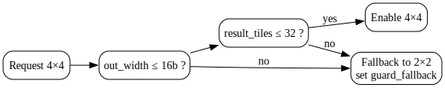
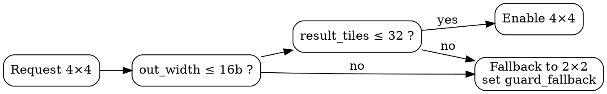
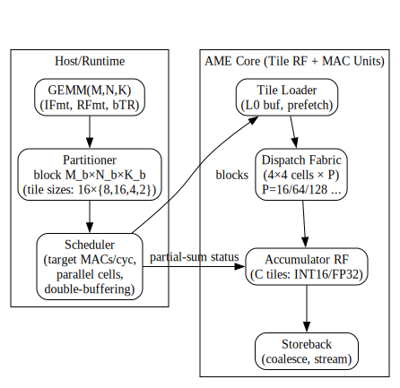
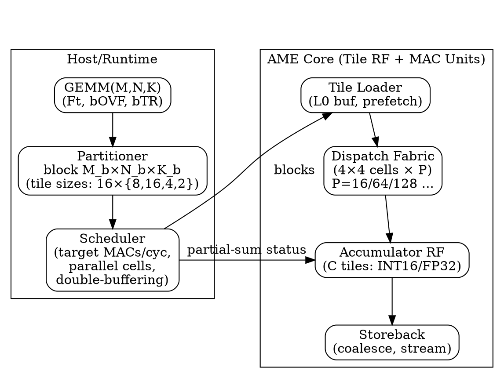
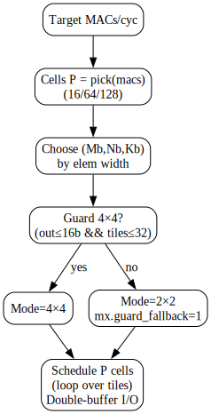
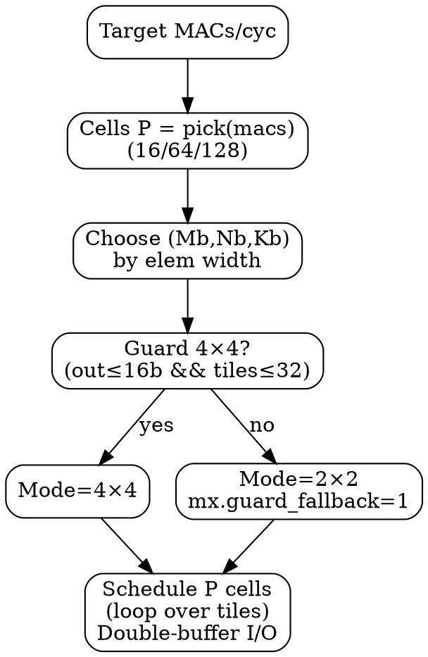
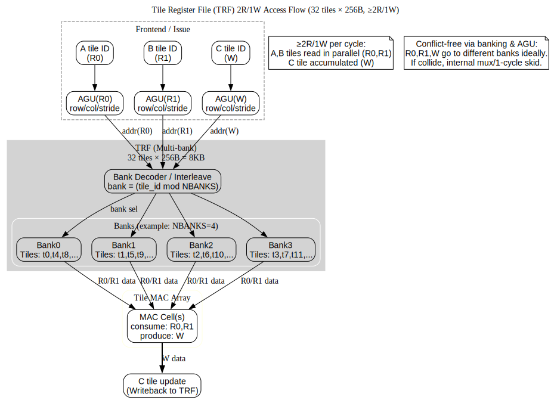

# AME MAC Dataformat and MAC workloads profile v0.15_ba — Proposals

> - Author : KyuTae Ahn (trustfarm.info@gmail.com , cpplover@trustfarm.net) 
> - Licenses : 
>      - Apache2.0, CC BY 4.0, 
>      - Additionally licensed under MIT for use in RISC-V, OpenRISC, and OSS TPU platforms
> - History : 
>   - Sep.19, 2025 Scaling tile MAC pseudocode view of SoC design profile V0.15
>   - Sep.18, 2025 Refinement of Dataformat view of SoC design profile V0.13
>   - Sep.18, 2025 AME MAC procedure and Dataformat profile V0.12
>   - Sep.15, 2025 AME Dataformat draft profile v0.1

---

## 1. **Signature**
```
C = MAC(A, B, K, M, bTR, bOVF, Ft)
```
- `A`, `B`: input **tile IDs** (from unified tile register file, 32 tiles total)
- `K`: number of elements **per row** in a tile (depends on element size)
- `M`: number of **rows** in a tile (default 16)
- `bTR`: **Transpose** of A or B (default 00b, 10b: AᵀxB, 01b:A×Bᵀ, 11b: Aᵀ×Bᵀ )  
- `bOVF`: overflow behavior for integer accumulate  
  - `1`: **Overflow ignore** (wrap/clip by implementation) → enables **INT8→INT8** or **FP8->FP8** path  
  - `0`: **Full accumulate** (default) → enables **INT8→INT16** or **FP8->FP16**path
- `Ft`: **Input FormatType** (8-bit code) — selects operand formats (INT8/FP8 types, etc.) and the implied accumulator/output

> For floating point, FP8 accumulates to **FP16**. For integer, **INT8** accumulates to **INT16** when `bOVF=0` and to **INT8** when `bOVF=1` (overflow ignored).


---

## 2. Legend
- **INT** = signed integer; **UINT** = unsigned integer  
- **FP** = floating point (IEEE-like unless noted)  
- **UF** = unsigned floating microscaling (uExMy)  
- **E\*M\*** = exponent/mantissa bit split (sign bit implied where 's' is used)  
- **Qm.n** = fixed-point with *m* integer bits, *n* fractional bits

---

> Scope: refresh **profiles/tables** to match AME MAC policy  
> INT8×INT8 → **INT16** (full) / **INT8** (overflow‑ignore), FP8(E4M3/E5M2) → **FP16**, FP16/BF16 → **FP32**.  
> Base compute cell: **4×4 tile** (16×16 elements per tile at 8b). Guarded 4×4 only when `out_width≤16` and `result_tiles≤32`.

---

## 3. AME Dataformat Profile (includes element-wise view by RV Profile)

| level | Common (must)            | HPC_baseline                | HPC_main                     | HPC_vns (VNS**)        | HPC_nte (NTE**) |
|------:|--------------------------|-----------------------------|------------------------------|------------------|---------------------|
| 1     | **INT8→INT8**, **FP8→FP8** (bOVF=1) |  **INT8->INT16**   ,    **FP8→FP16** , **INT16->INT16** , **FP16->FP16**  (bOVF=1)  | **BF16->BF16** (bOVF=1) , **BF16->FP32**  , **INT16→INT32** | **E8M8→FP32**, **E8M8->E8M8** (bOVF=1), **BF16->TF32** , **INT8->INT32** | **FP8(other)** , **FP4(other)**  |
| 2     | **INT8→INT16**, **FP8→FP16**    | **FP8→FP16**, **FP16→FP32**, **BF16->BF16** (bOVF=1) | **BF16→TF32**, **FP32->FP32** , **TF32->TF32** (bOVF=1) |   -               |     -                |
| 3     | -            | -              | -              | -            | -             |
| 4     | -            | -              | -              | -            | -             |
| 5     | -            | -              | -              | -            | -             |
|       |              | **IOT_fp_ext** | **IOT_int_ext** | **IOT_vns (VNS\*\*)** | **IOT_nte  (NTE\*\*)** |
| 1     | -            | **FP8\*** → **FP8\*** (bOVF=1) | **INT8->INT8** (bOVF=1) |  **UE8M0 -> UE8M0** (bOVF=1) , **UE8M0→BF16**  | FP8(sE5M2), FP4(E2M2) |                 |
| 2     | -            | **FP4->FP8**, **FP8\*→FP16**, **FP16->FP16** (bOVF=1)   |**INT16->INT16** (bOVF=1), **INT8->INT16** , | -          | -              | 
| 3     | -            | -              | -              | -            | -             | 
| 4     | -            | -              | -              | -            | -             |
| 5     | -            | -              | -              | -            | -             |


--- 

Notes:  
- **NTE\*\***: *Need Test and Evaluate / reserved*.  
- **VNS\*\***: *Vendor Specific  / reserved*.  
- `**` means optional per-market , vendor-specific subset subject to evaluation and silicon budget.

---


**Element‑wise policy**  
- Narrow→wide casts follow the accumulate policy (e.g., `FP8→FP16`, `INT8→INT16`).  
- Saturation (`SAT`) applies only when `bOVF=0` in integer ops.  
- `Qe.m` fixed‑point ops allowed up to **16bits** in baseline; wider Q formats are extensions.

---


## 4. FormatType (Ft) Codes (8-bit)

 - FmT family ranges: 0x10=8b, 0x20=16b, 0x40=32b, 0x80=64b; 0x01–0x0F sub-byte; 0xD0–EF vendor.

| Width   | Code         | Type           | Notes                            |
| ------- | ------------ | -------------- | -------------------------------- |
| default | 0x00         | **INT8**       | **Default** (lane basic)             |
|    -    |    -         |  -             | -                                |
| 4bits   | 0x01         | **INT4**       | 4-bit 2’s complement             |
|         | 0x02         | **FP4 sE2M1**  | **FP4 Default** (sign,2 exp,1 mant) |
|         | 0x03         | **FP4 sE1M2**  | MX-style (sign, 1 exp, 2 mant) |
|         | 0x04         | **UF4 E2M2**   | unsigned microscaling            |
|         | 0x05         | **UF4 E1M3**   | unsigned microscaling            |
|   -     |    -         |   -            |   -                              |
| 6bits   | 0x06         | **FP6 sE3M2**  | **FP6 Default**                    |
|         | 0x07         | **FP6 sE2M3**  | FP6 (range ↓,mant ↑)             |
|         | 0x08         | **FP6 sE4M1**  | FP6 (range ↑, mant ↓)            |
|         | 0x09         | **UF6 E4M2**   | unsigned microscaling            |
|         | 0x0A–0x0F    | RESERVED       | reserved for future use          |
|   -     |    -         |   -            |   -                              |
| 8bits   | 0x10         | **INT8**       | **8-bit signed** integer             |
|         | 0x11         | **FP8 sE4M3**  | **FP8 Default** (sign, 4 exp, 3 mant)|
|         | 0x12         | **FP8 sE5M2**  | FP8 Alter (sign, 5 exp, 2 mant)  |
|         | 0x13         | **UE8 E8M0**   | unsigned FP (8 exp, 8 mant)      |
|         | 0x14         | **Q4.3**       | fixed-point sINT4+3MANT          |
|         | 0x15         | **Q2.5**       | fixed-point sINT2+5MANT          |
|         | 0x16–0x17    | RESERVED       | 8-bit Reserved                   |
|   -     |    -         |   -            |   -                              |
| 12bits  | 0x18         | **INT12**      | 12-bit signed integer            |
|         | 0x19         | **FP12 sE5M6** | **FP12 Default**                   |
|         | 0x1A         | **FP12 sE4M7** | FP12 (range ↓,mant ↑)            |
|         | 0x1B         | **Q4.8**       | fixed-point sINT4+8MANT          |
|         | 0x1C         | **Q5.7**       | fixed-point sINT5+7MANT          |
|         | 0x1D–0x1F    | RESERVED       | 12-bit Reserved                  |
|   -     |    -         |   -            |   -                              |
| 16bits  | 0x20         | **INT16**      | 16-bit signed integer            |
|         | 0x28         | **FP16**       | **IEEE half precision (sE5M10)**   |
|         | 0x29         | **BF16**       | **bfloat16  (sE8M7)**                |
|         | 0x2A         | **UF16 E8M8**  | unsigned FP16  (E8M8)            |
|         | 0x2B         | **Q8.8**       | fixed-point sINT8+8MANT          |
|         | 0x2C–0x2F | RESERVED    | 16-bit Reserved                  |
|   -     |    -         |   -            |   -                              |
| 32bits  | 0x40         | **INT32**      | 32-bit signed integer            |
|         | 0x48         | **FP32**       | **IEEE single precision (sE8M23)**   |
|         | 0x49         | **TF32**       | NVIDIA-style TF32  (sE8M10)      |
|         | 0x4A         | **Q16.16**     | fixed-point sINT16+16MANT        |
|         | 0x4B–0x4F | RESERVED    | 32-bit Reserved                  |
|   -     |    -         |   -            |   -                              |
| 64bits  | 0x80         | **INT64**      | 64-bit signed integer            |
|         | 0x88         | **FP64**       | **IEEE double precision (sE11M52)**  |
|         | 0x8A         | **Q32.32**     | fixed-point sINT32+32MANT        |
|         | 0x8B–0x8F | RESERVED    | 64-bit Reservered                 |
|   -     |    -         |   -            |   -                              |
| VENDOR  | 0xD0~DF      | **VendorFmt**  | Vendor Specific private format   |
| TESTING | 0xE0~EF      | **VendorFmt**  | Vendor Testing private format    |
|-------- |--------------|----------------|----------------------------------|

---

> **Resolution rule** (examples):  
> - `Ft=INT8`, `bOVF=0` ⇒ **A,B: INT8**, **C: INT16** (full accumulate)  
> - `Ft=INT8`, `bOVF=1` ⇒ **A,B: INT8**, **C: INT8** (overflow ignored)  
> - `Ft=FP8(E4M3 or E5M2)` ⇒ **A,B: FP8**, **C: FP16** (rounding mode via CSR)
> - `Ft=FP16` ⇒ **A,B: FP16**, **C: FP32** (rounding mode via CSR)

---

- ### Format Comments and References
  - NTE** : Need to Testing and Evaluations.
  - VNS** : Vendor Specific use purpose
  - FP8*  : Default [sE4M3] - Nvidia [Recipes for Pre-training LLMs with MXFP8](https://arxiv.org/pdf/2506.08027)
  - INT8 : Qualcomm - [FP8 versus INT8 for efficient deep learning inference.](https://ar5iv.labs.arxiv.org/html/2303.17951)
  - INT16 : Intel [MIXED PRECISION TRAINING OF CNN USING INT](https://arxiv.org/pdf/1802.00930) ,  
            Facebook [OSS FBGEMM](https://engineering.fb.com/2018/11/07/ml-applications/fbgemm/) ,
            SemiconEngineering [Data Formats For Inference On The Edge](https://semiengineering.com/data-formats-for-inference-on-the-edge/)
  - UE8M0 : [OCP Microscaling Formats (MX) Specification](https://www.opencompute.org/documents/ocp-microscaling-formats-mx-v1-0-spec-final-pdf)
  and [IEEE WG P3109 Interim report v3](https://github.com/P3109/Public/blob/main/IEEE%20WG%20P3109%20Interim%20Report%20v3.pdf)
  - E8M8 : Extended from UE8M0 [Trustfarm TFSDxr](https://github.com/trustfarm/TFSDxr-Neuron-Quantization/blob/main/docs/tfsd_quant/README_en.md)
  - FP4 : Default [sE2M1] - [Nvidia NVFP4](https://developer.nvidia.com/blog/introducing-nvfp4-for-efficient-and-accurate-low-precision-inference) and [Optizing LLM FP4](https://arxiv.org/html/2501.17116v2)
  - Qe.m : [Trainable Fixed-Point Quantization for Deep Learning Acceleration on FPGAs](https://arxiv.org/html/2401.17544v1)
  - FP6 : Default [sE3M2] - [MITSUBISHI Hardware-Efficient Quantization for Green Custom
 Foundation Models](https://www.merl.com/publications/docs/TR2024-105.pdf)
  - Related useful links [Awesome-Model-Quantization](https://github.com/Kai-Liu001/Awesome-Model-Quantization)
  - [Low-bit Model Quantization for Deep Neural Networks: A Survey](https://arxiv.org/html/2505.05530v1)
    
---
## 5. Unified Tile Register File & Tile Geometry

- 32 unified tile registers. Each tile stores `M` rows (default 16), `K` columns determined by element width.  
- Default geometries (per tile):
  - **8-bit**  : `16×16` (256 elements, 256 Bytes/tile)
  - **16-bit** : `16×8`  (128 elements, 256 Bytes/tile)
  - **32-bit** : `16×4`  ( 64 elements, 256 Bytes/tile)
  - **64-bit** : `16×2`  ( 32 elements, 256 Bytes/tile)

### Tiling Modes
- **2×2** (default), **1×4**, **4×1** — universal
- **Guarded 4×4** — enabled **only if** `(output element width ≤ 16b)` and the **result tile count ≤ 32**
  - **Allowed**: `INT8→INT8` (bOVF=1), `INT8→INT16` (bOVF=0), `FP8→FP16`
  - **Not allowed**: accumulators wider than 16b (e.g., `INT8→INT32`, `FP16→FP32`)

---

## 6. CSR Layout (proposal)

```
mxcfg (0x7C0)
  [7:0]   Ft           ; 8-bit FormatType (see table)
  [8]     bOVF         ; 1=Overflow ignore (INT8→INT8), 0=Full (INT8→INT16) ; ignored for FP8
  [11:9]  RND          ; FP rounding mode (0:nearest-even, 1:toward+inf, 2:toward-inf, 3:toward0, RSVD)
  [12]    SAT          ; Integer saturate enable (optional; applies when bOVF=0)
  [31:13] reserved

mxtile (0x7C1)
  [7:0]   K            ; columns per row (depends on Ft; typical: 16/8/4/2)
  [15:8]  M            ; rows per tile (default 16)
  [17:16] TILING       ; 0:1×1, 1:2×2, 2:1×4, 3:4×1
  [18]    GUARD4x4     ; 1=attempt 4×4 if guard passes; else fallback
  [31:19] reserved
```

- **Guard check** (hardware): If `GUARD4x4=1` and `(out_width ≤ 16)` and `(result_tiles_4x4 ≤ 32)` ⇒ enable 4×4; else **fallback to 2×2** and set the sticky status CSR `mx.guard_fallback`.

```C title="tiling_mode_pseudocode.c"
// -------------------------------------------------------------------------
// Output bit-width rules (examples by Ft + bOVF):
//   INT8,  bOVF=1  → out_width_bits = 8    (INT8→INT8)
//   INT8,  bOVF=0  → out_width_bits = 16   (INT8→INT16)
//   FP8(E4M3/E5M2) → out_width_bits = 16   (FP8→FP16)
//   INT16          → out_width_bits = 16   (INT16→INT16)
//   FP16/BF16      → out_width_bits = 32   (FP16→FP32, BF16→FP32)
//   FP32           → out_width_bits = 32   (FP32→FP32)
//   FP64           → out_width_bits = 64   (FP64→FP64)
//   (others → default 32)
//
// result_tiles_4x4 meaning:
//   - One logical “tile” register = 16 rows × (elements per row).
//   - If output element size grows, one logical result tile may
//     spill into multiple physical tile registers.
//   - Example:
//       INT8→INT8   (8-bit out)   → each result [16×16] fits in 1 tile
//       INT8→INT16  (16-bit out)  → each result [16×16] needs 2 tiles
//       FP8→FP16    (16-bit out)  → same, 2 tiles
//       FP16→FP32   (32-bit out)  → each result [16×16] needs 4 tiles
//   - So result_tiles_4x4 = (# of sub-matrix results) × (tiles per result).
// -------------------------------------------------------------------------

void select_tiling_mode(bool GUARD4x4,
                        uint8_t out_width_bits,
                        uint16_t result_tiles_4x4,
                        /*out*/ uint8_t *mode,
                        /*CSR*/ volatile uint8_t *mx_guard_fallback)
{
    bool ok = (GUARD4x4 == true)
           && (out_width_bits <= 16)      // only 8b/16b outputs allowed
           && (result_tiles_4x4 <= 32);   // must fit within RF capacity

    if (ok) {
        *mode = MODE_4x4;
    } else {
        *mode = MODE_2x2;
        *mx_guard_fallback = 1;           // sticky CSR flag
    }
}

```

## 7. Instruction Sketch

```
MMACC.T  tC_base, tA_base, tB_base, imm
  ; Compute C = A × Bᵀ with current CSR (mxcfg, mxtile)
  ; imm encodes small options: beta accumulation, alpha scaling, transpose flags

Example:
  li   t0, (Ft=INT8 | bOVF=0)       ; INT8→INT16 full-acc
  csrw mxcfg, t0
  li   t1, (K=16 | M=16 | TILING=2×2)
  csrw mxtile, t1
  MMACC.T  tC0, tA0, tB0, 0
```

- **Result mapping (2×2)** — deterministic:
  - `A0×B0 → C0..C3`, `A0×B1 → C4..C7`, `A1×B0 → C8..C11`, `A1×B1 → C12..C15`
- **Result mapping (1×4/4×1)** — contiguous `C` groups per broadcast dimension

---

## 8. Validation & Fallback

- **Type/Geometry check**: hardware validates `(Ft, K, M)` against tile geometry. Mismatch ⇒ precise trap `mx.badgeom`.
- **Guarded 4×4**: if guard fails, execute as 2×2 and set `mx.guard_fallback` sticky bit in a status CSR.
- **INT overflow**: if `bOVF=0` and `SAT=0`, overflow wraps by 2's complement; if `SAT=1`, saturate to min/max.
- **FP8**: accumulates in FP16 with selected rounding mode; optional denorm-flush is implementation-defined (report via CSR).


---

## 9. Examples

### 1) **INT8→INT8** (overflow ignore)
```
csrw mxcfg, Ft=INT8 | bOVF=1
csrw mxtile, K=16 | M=16 | TILING=2×2
MMACC.T tC0, tA0, tB0, 0   ; C tiles hold int8
```

### 2) **INT8→INT16** (full MAC)
```
csrw mxcfg, Ft=INT8 | bOVF=0 | SAT=1   ; enable saturation
csrw mxtile, K=16 | M=16 | TILING=2×2 | GUARD4x4=1
MMACC.T tC0, tA0, tB0, 0   ; attempts 4×4; will guard-check
```

### 3) **FP8(E4M3)→FP16**
```
csrw mxcfg, Ft=FP8(E4M3) | RND=nearest-even
csrw mxtile, K=16 | M=16 | TILING=2×2
MMACC.T tC0, tA0, tB0, 0
```

---

### Abbreviations
- **RF**: Register File  
- **MAC**: Multiply–Accumulate  
- **GEMM**: General Matrix Multiply  
- **CSR**: Control & Status Register  
- **RND**: Rounding mode  
- **SAT**: Saturation mode  

---

## 10. HW Notes
1. **Banking & Ports**: 32 tiles × 256B each ⇒ 8KB (8/16/32-bit modes). Provide ≥2R/1W ports per bank for 2×2 (See [Appendix ](#appendix-c-tile-register-file-trf-banking--port-semantics) for details).
2. **Throughput tiers**: 1k..32k MACs/cycle map to 64B..512B/cycle read BW as discussed in the thread.  
3. **Store scheduling**: For 4×4 guarded mode, ensure writeback slots avoid RF spill; otherwise guard falls back.  
4. **Cache hints**: Stream/non-temporal stores for C.  
5. **Status CSRs**: `mx.guard_fallback`, `mx.badgeom`, `mx.inexact`, `mx.sat_hit`.


---

### Tiny Graphviz (Guarded 4×4 Decision)







---

## 11. Detailed Tiling Modes

AME MAC executes on a unified 2D tile register file (32 tiles, each with 16 rows).  
The **tiling mode** defines how input tiles (A, B) are combined and how results are mapped into output tiles (C).  
This section refines the tiling description for hardware implementers.

### 1. 2×2 Mode (default)

- **Inputs**: A=2 tiles (A0,A1), B=2 tiles (B0,B1)
- **Outputs**: 16 C tiles (C0–C15)
- **Mapping**:
  - A0×B0 → C0–C3  
  - A0×B1 → C4–C7  
  - A1×B0 → C8–C11  
  - A1×B1 → C12–C15
- **Use case**: Balanced, universal for INT8→INT16 and FP8→FP16.

### 2. 1×4 Mode
- **Inputs**: A=1 tile (A0), B=4 tiles (B0–B3)
- **Outputs**: 16 C tiles
- **Mapping**:
  - A0×B0 → C0–C3  
  - A0×B1 → C4–C7  
  - A0×B2 → C8–C11  
  - A0×B3 → C12–C15
- **Use case**: Broadcasting A across multiple B tiles.

### 3. 4×1 Mode
- **Inputs**: A=4 tiles (A0–A3), B=1 tile (B0)
- **Outputs**: 16 C tiles
- **Mapping**:
  - A0×B0 → C0–C3  
  - A1×B0 → C4–C7  
  - A2×B0 → C8–C11  
  - A3×B0 → C12–C15
- **Use case**: Broadcasting B across multiple A tiles.

### 4. Guarded 4×4 Mode
- **Inputs**: A=4 tiles, B=4 tiles
- **Naive output**: >32 C tiles (exceeds 32-tile RF capacity)
- **Guard conditions** (hardware must check):
  1. **Output element width ≤ 16b**  
     - Allowed: INT8→INT8 (bOVF=1), INT8→INT16 (bOVF=0), FP8→FP16  
     - Not allowed: wider accumulators (INT32, FP32)
  2. **Total result tile count ≤ 32**
- **Behavior**:
  - If guard passes → execute in 4×4 mode.  
  - If guard fails → fallback to 2×2 mode, set sticky CSR flag `mx.guard_fallback`.
- **Meaning**: Guarded = conditionally enabled depending on datatype and tile usage.

---

## 12. Additional Implementation Notes

- **Transpose (bTR)**: Aᵀ×B, A×Bᵀ, Aᵀ×Bᵀ supported, set via CSR.  
- **Overflow (bOVF)**:  
  - INT8: `bOVF=1` → INT8→INT8 (wrap/clip), `bOVF=0` → INT8→INT16 (full MAC).  
  - FP8: `bOVF=1` → FP8→FP8 (rare), `bOVF=0` → FP8→FP16 (default).  
- **Validation**: Format/geometry mismatch → trap (`mx.badgeom`).  
- **Fallback**: Guarded 4×4 automatically downgrades if conditions fail.  
- **Status CSRs**:  
  - `mx.guard_fallback` — indicates guarded mode fallback occurred.  
  - `mx.badgeom` — geometry mismatch.  
  - `mx.inexact` — FP rounding inexact.  
  - `mx.sat_hit` — saturation event.  
- **Writeback & Scheduling**: To avoid RF overflow in guarded mode, implementers should prioritize store scheduling and RF bank allocation.

---
## 13. Matrix Size & Scaling Guidance (for compiler/runtime)

- **Base cell**: 4×4 tiles (16×16 at 8bits). Larger throughput = **multi‑cell parallelism** or **multi‑thread dispatch**.  
- **Throughput points** (illustrative): 4k/16k/32k MACs/cycle → ~16/64/128 parallel cells, respectively.  
- **Large GEMM (≥1k)**: decompose into tile blocks; orchestrate dataflow/buffers to keep accumulators resident and avoid spills.  
- **LLM path**: BF16/FP16 inputs with **FP32 accumulate**; scheduler should prioritize FP32 accumulator residency and double‑buffered tile loads.

---

## 14. Proposal: AME MAC Accumulation Policy and Scalability for Large GEMM/LLM Workloads

### 1. Accumulation Type for INT8
The previous suggestion of **INT8×INT8 → INT32 accumulate** is unnecessarily complex for hardware:

- **Drawbacks of INT32 accumulate**:  
  - Large accumulator/register file width.  
  - Increased power, wiring, and latency overhead.  
  - Difficult to keep within tile register file limits.

- **Simplified alternative (recommended):**  
  - **INT8×INT8 → INT16 accumulate** when `bOVF=0` (full accumulate).  
  - **INT8×INT8 → INT8 accumulate** when `bOVF=1` (overflow ignore).  
  - This matches the approach taken in Google TPU v1, which only provided INT8→INT16.  

**Conclusion:** INT16 accumulation is sufficient in practice. INT32 accumulation only adds hardware burden without real benefits.

---

### 2. Tile 4×4 as the Base Cell
- Each **4×4 tile cell** is defined as a 16×16 submatrix operation.  
- Larger MAC throughput (4k, 16k, 32k MACs/cycle) should not be achieved by changing the tile shape, but rather by **parallelizing multiple 4×4 cells**.  

**Scaling strategies:**
- **Multi-thread dispatch**: Multiple tile instructions in flight across independent issue slots.  
- **Multi-cell parallelism**: Multiple 4×4 cells executed per cycle.  
- **Macro-tiling**: Hardware supports dispatching clusters of tiles in parallel.

**Example mapping:**
- 4k MAC/cycle  → ~16 parallel 4×4 cells  
- 16k MAC/cycle → ~64 parallel cells  
- 32k MAC/cycle → ~128 parallel cells  

This ensures scalability without complicating the ISA or tile register file.

---

### 3. LLM Workload Considerations
Large Language Models (LLMs) impose specific requirements:

- **Input formats:** BF16 / FP16 weights and activations.  
- **Accumulator format:** FP32 (or TF32).  
- **Matrix dimensions:** typically ≥1k.  

**Implications for AME:**
1. **Tile-level multiply:** FP16/BF16 tiles (16×16) with FP32 accumulate.  
2. **Accumulator capacity:** Tile register file must support FP32 results without frequent spills.  
3. **Parallel scheduling:** Large GEMM kernels (≥1k×1k) are constructed by looping and dispatching multiple 4×4 cells, with partial-sum synchronization.  
4. **ISA simplicity:** ISA defines only the tile cell and accumulation semantics. Large-matrix decomposition is handled by compiler/runtime, not the instruction itself.  

---

### 4. Recommended Direction
1. **Adopt INT8→INT16 accumulate as default.**  
   - Overflow ignore (`bOVF=1`) provides an INT8→INT8 fast path.  
   - INT32 accumulate is unnecessary.  

2. **Keep tile size fixed at 4×4.**  
   - Scale performance by replicating or dispatching multiple cells, not by changing the base ISA.  

3. **Support FP32 accumulation for FP16/BF16 inputs.**  
   - Critical for LLM workloads.  

4. **Separate ISA from large-matrix scaling.**  
   - ISA only defines the 4×4 MAC cell.  
   - Runtime/compiler orchestrates decomposition for large GEMMs (1k–32k).  

---


## 15. 📌 Related Trends and Background

Recent industry and research directions highlight why **INT8→INT16** or **BF16/FP16→FP32** accumulation is the practical path, instead of always targeting INT32 accumulation:

- Google LiteRT now supports a “16×8” quantization mode: weights in INT8, activations in INT16.  
  This approach preserves more accuracy than pure INT8 while keeping model size small.  
  Ref: [ai.google.dev](https://ai.google.dev/edge/litert/models/post_training_integer_quant_16x8)

- *Quantifying Reduced Precision Effects on LLM Training Stability* (arXiv 2405.18710):  
  Demonstrates that **BF16 has become the de facto standard** for LLM training, with FP8 still being experimental.  
  Ref: [arxiv.org](https://arxiv.org/html/2405.18710v2)

- *Give Me BF16 or Give Me Death? Accuracy‑Performance Trade‑Offs in LLM Quantization* (arXiv 2411.02355):  
  Shows that at large model scales, **BF16/FP16 inputs with FP32 accumulation** are widely adopted for both training and inference.  
  Ref: [arxiv.org](https://arxiv.org/abs/2411.02355)

**Conclusion:**  
- For inference, **INT8 weights with INT16 accumulations** are sufficient and increasingly popular.  
- For LLM workloads, **BF16/FP16 inputs with FP32 accumulation** remain the stable and dominant approach.  
- INT32 accumulation is not the industry baseline and should not be enforced in AME.


### 13.A  Scaling Flow (DOT)






**Legend**  
- **P** = number of 4×4 cells in parallel to meet a throughput point (e.g., 4k→P≈16, 16k→P≈64, 32k→P≈128).  
- **Accumulator RF** width is determined by `out_width_bits` (INT16 for INT8→INT16, FP32 for BF16/FP16→FP32).  
- **Double-buffering** keeps loader/compute/store overlapped.

---

### 13.B  Compiler/Runtime Pseudocode (C, integer-only)

```c
#define TILE_ROWS 16   // M per tile
static inline uint8_t elems_per_row(uint8_t elem_bits) {
    // 8b:16, 16b:8, 32b:4, 64b:2
    if (elem_bits==8)  return 16;
    if (elem_bits==16) return 8;
    if (elem_bits==32) return 4;
    return 2; // 64b
}

typedef struct {
    uint16_t Mb, Nb, Kb;     // block sizes (multiples of TILE_ROWS and elems_per_row)
    uint16_t cells_parallel; // P: 16/64/128 ...
} block_plan_t;

// Map throughput target (MACs/cycle) to number of parallel 4×4 cells
static inline uint16_t pick_cells(uint32_t macs_per_cycle_target) {
    if (macs_per_cycle_target <= 4096)  return 16;   // ~4k
    if (macs_per_cycle_target <= 16384) return 64;   // ~16k
    return 128;                                      // ~32k (or higher tiers)
}

// Block chooser (simple heuristic)
block_plan_t make_plan(uint32_t macs_per_cycle_target,
                       uint8_t in_bits, uint8_t out_bits) {
    block_plan_t p;
    p.cells_parallel = pick_cells(macs_per_cycle_target);

    // Favor square-ish blocks; keep Kb multiple of TILE_ROWS for reuse
    p.Mb = TILE_ROWS * 4; // 64 rows
    p.Nb = TILE_ROWS * 4; // 64 cols
    // K granularity: one tile-row = elems_per_row(in_bits)
    p.Kb = elems_per_row(in_bits) * 8; // e.g., 8 tiles depth

    // Guard 4×4 usage: only when out ≤16b; otherwise 2×2
    // Runtime can set GUARD4x4 CSR accordingly.
    (void)out_bits;
    return p;
}

void gemm_schedule(uint32_t M, uint32_t N, uint32_t K,
                   uint8_t in_bits, uint8_t out_bits,
                   uint32_t macs_per_cycle_target)
{
    block_plan_t plan = make_plan(macs_per_cycle_target, in_bits, out_bits);
    const uint16_t P = plan.cells_parallel;

    // Double buffers for A/B tiles per K-slice
    for (uint32_t m0=0; m0<M; m0+=plan.Mb) {
      for (uint32_t n0=0; n0<N; n0+=plan.Nb) {

        // Zero/prepare C tiles in RF (width = out_bits)
        // configure CSR: Ft, bOVF, RND, SAT; mxtile: K, M, TILING, GUARD4x4

        for (uint32_t k0=0; k0<K; k0+=plan.Kb) {
          // Stage (t) and (t+1) slices: preload next while computing current
          // Issue up to P parallel 4×4 cells across the (Mb,Nb) block

          // Pseudocode for issuing cells over tiles:
          for (uint16_t pcell=0; pcell<P; ++pcell) {
            // select tile IDs for A,B sub-blocks (tiled by 16x{16,8,4,2})
            // MMACC.T tC_base+pcell, tA_base+pcell, tB_base+pcell, 0;
          }

          // optional: reduce partial sums if block-sliced
        }

        // Storeback of C tiles (streaming / coalesced)
      }
    }
}
```

---

## 14.A  Policy-Driven Guarding (C, integer-only)

```c
// out_width_bits rules (subset):
//   INT8,bOVF=1 → 8; INT8,bOVF=0 → 16; FP8 → 16; FP16/BF16 → 32.
static inline uint8_t out_width_bits(uint8_t Ft, uint8_t bOVF) {
    if (Ft==0x10) return (bOVF ? 8 : 16);  // INT8
    if (Ft==0x11 || Ft==0x12) return 16;   // FP8
    if (Ft==0x28 || Ft==0x29) return 32;   // FP16/BF16 → FP32
    if (Ft==0x48) return 32;               // FP32
    return 32;                              // default conservative
}

// tiles per [16×16] result as a function of out width
static inline uint8_t tiles_per_result(uint8_t out_bits) {
    if (out_bits <= 8)  return 1;  // INT8
    if (out_bits <= 16) return 2;  // INT16 / FP16
    if (out_bits <= 32) return 4;  // FP32
    return 8;                      // FP64
}

// compute result_tiles_4x4 for a block = (#sub-results) × (tiles_per_result)
static inline uint16_t result_tiles_4x4(uint16_t sub_results, uint8_t out_bits) {
    return (uint16_t)sub_results * (uint16_t)tiles_per_result(out_bits);
}

// Guard check: enable 4×4 only if safe by type/capacity
static inline uint8_t select_tiling_44(uint8_t GUARD4x4,
                                       uint8_t Ft, uint8_t bOVF,
                                       uint16_t sub_results)
{
    const uint8_t outw = out_width_bits(Ft, bOVF);
    const uint16_t tiles4 = result_tiles_4x4(sub_results, outw);
    if (GUARD4x4 && (outw <= 16) && (tiles4 <= 32)) {
        return /*MODE_4x4*/ 3;
    }
    return /*MODE_2x2*/ 1;
}
```

### 14.B  Scaling Policy Flow (DOT)






---

## Appendix C. Tile Register File (TRF) Banking & Port Semantics

**Banking & Ports: 32 tiles × 256B each ⇒ 8KB (8/16/32-bit modes). Provide ≥2R/1W**

### 1. Capacity
- **Tile size**: 256B  
- **Total tiles**: 32 ⇒ `32 × 256B = 8192B = 8KB`  
- **Element layouts**:
  - 8-bit mode  → 16×16 = 256 elements/tile
  - 16-bit mode → 16×8  = 128 elements/tile
  - 32-bit mode → 16×4  = 64 elements/tile

### 2. Port Requirements
- **≥2R/1W**: at least **two reads + one write per cycle**
  - **Why?** GEMM/GEMV requires:
    - Read **A tile** + **B tile** simultaneously → **2R**
    - Write/accumulate into **C tile** → **1W**
  - This matches the core compute pattern `C = A × B`

### 3. Banking Architecture
- Direct single-bank SRAM would cause conflicts.  
- Solution: **multi-bank partitioning** (e.g., 4 banks × 8 tiles each).  
- Address Generation Unit (AGU) & bank decoders ensure:
  - Conflict-free parallel access
  - Deterministic latency for 2R/1W issue

### 4. Why Not More Ports?
- >2R/1W (e.g., 4R/2W) increases area, wiring, and energy cost.  
- ≥2R/1W is the **sweet spot** for matrix multiply workloads:
  - Sufficient to cover one multiply-accumulate step per cycle
  - Balanced against silicon cost

---

### 5. Reference Flow charts.



**Summary:**  
The TRF must sustain **2 simultaneous reads** (for operands A and B) and **1 write** (for result C) every cycle.  
This guarantees that tile-level GEMM operations are not starved by register file bandwidth, while keeping the design scalable and cost-efficient.

