# AME MAC Dataformat and MAC workloads profile v0.17 — Proposals

> - Author : KyuTae Ahn (trustfarm.info@gmail.com , cpplover@trustfarm.net) 
> - Licenses : 
>      - Apache2.0, CC BY 4.0, 
>      - Additionally licensed under MIT for use in RISC-V, OpenRISC, and OSS TPU platforms
>
> - History : 
>   - Sep.22, 2025 **bOVF → RFmt (Result Format, 8-bit)** and **Ft → IFmt (Input Format, 8-bit)**; Resolution rules expanded v0.17
>   - Sep.22, 2025 svg link refers github link, for manage 1 copy of this md file
>   - Sep.21, 2025 int8,int16 reference materials link updates V0.16
>   - Sep.19, 2025 Adds Appendix tile operations more detailed 2R/1W
>   - Sep.19, 2025 Scaling tile MAC pseudocode view of SoC design profile V0.15
>   - Sep.18, 2025 Refinement of Dataformat view of SoC design profile V0.13
>   - Sep.18, 2025 AME MAC procedure and Dataformat profile V0.12
>   - Sep.15, 2025 AME Dataformat draft profile v0.1

---

## 1. **Signature**

```
C = MAC(A, B, K, M, bTR, RFmt, IFmt)
```
- `A`, `B`: input **tile IDs** (from unified tile register file, 32 tiles total)
- `K` : number of elements **per row** in a tile (depends on element width)  
- `M` : number of **rows** in a tile (default 16)  
- `bTR` : transpose flags (00: A×B, 01: A×Bᵀ, 10: Aᵀ×B, 11: Aᵀ×Bᵀ)  
- `RFmt` : **Result Format (8-bit)** — selects accumulator/output data type  
- `IFmt` : **Input Format (8-bit)** — selects operand data type (formerly `Ft`)

> **Note:** Moving from `bOVF`(1-bit) to `RFmt`(8-bit) exposes explicit control over the **accumulate/output** precision (e.g., INT8/INT16/BF16/FP32), improving portability and compiler scheduling.
  You can configure many Input formats to map Result formats , by design of customized MUL kernel

---

## 2. Legend
- **INT** = signed integer; **UINT** = unsigned integer  
- **FP** = floating point (IEEE-like unless noted)  
- **UF** = unsigned floating microscaling (uExMy)  
- **E\*M\*** = exponent/mantissa bit split (sign bit implied where 's' is used)  
- **Qm.n** = fixed-point with *m* integer bits, *n* fractional bits

---

> Scope: refresh **profiles/tables** to match AME MAC policy  
> INT8×INT8 → **INT16** (full) / **INT8** (overflow‑ignore), FP8(E4M3/E5M2) → **FP16**, FP16/BF16 → **FP32**.  
> Base compute cell: **4×4 tile** (16×16 elements per tile at 8b). Guarded 4×4 only when `out_width≤16` and `result_tiles≤32`.

---

## 3. AME Dataformat Profile (includes element-wise view by RV Profile)

| level | Common (must)            | HPC_baseline                | HPC_main                     | HPC_vns (VNS**)        | HPC_nte (NTE**) |
|------:|--------------------------|-----------------------------|------------------------------|------------------|---------------------|
| 1     | **INT8→INT8** (SAT=0) , **FP8→FP8** |  **INT8->INT16** ,    **FP8→FP16** , **INT16->INT16** (SAT=0) , **FP16->FP16** | **BF16->BF16** , **BF16->FP32**  , **INT16→INT32** | **E8M8→FP32**, **E8M8->E8M8** , **BF16->TF32** , **INT8->INT32** | **FP8(other)** , **FP4(other)**  |
| 2     | **INT8→INT16**, **FP8→FP16**    | **FP8→FP16**, **FP16→FP32**, **BF16->BF16** | **BF16→TF32**, **FP32->FP32** , **TF32->TF32** |   -               |     -                |
| 3     | -            | -              | -              | -            | -             |
| 4     | -            | -              | -              | -            | -             |
| 5     | -            | -              | -              | -            | -             |
|       |              | **IOT_fp_ext** | **IOT_int_ext** | **IOT_vns (VNS\*\*)** | **IOT_nte  (NTE\*\*)** |
| 1     | -            | **FP8\*** → **FP8\*** | **INT8->INT8** (SAT=0) |  **UE8M0 -> UE8M0**  , **UE8M0→BF16**  | FP8(sE5M2), FP4(E2M2) |                 |
| 2     | -            | **FP4->FP8**, **FP8\*→FP16**, **FP16->FP16**    |**INT16->INT16** (SAT=0), **INT8->INT16** (SAT=1) , | -          | -              | 
| 3     | -            | -              | -              | -            | -             | 
| 4     | -            | -              | -              | -            | -             |
| 5     | -            | -              | -              | -            | -             |


--- 


Notes:  
- **NTE\*\***: *Need Test and Evaluate / reserved*.  
- **VNS\*\***: *Vendor Specific  / reserved*.  
- `**` means optional per-market , vendor-specific subset subject to evaluation and silicon budget.

---

### 3.1 Element-wise Policy

- **Narrow → Wide Casts**  
  Follow the accumulate policy:  
  - Example: `FP8→FP16`, `INT8→INT16`  
  - The accumulator/output precision is strictly determined by `RFmt`.

- **Integer Saturation (SAT) , unaffected on Floating-point**  
  Applies **only when** **`DataWidth(RFmt) > DataWidth(IFmt)`** for **integer** operations.  
  - Example: `INT8 (0x10) → INT16 (0x20)` with `SAT=1` → saturating extend  
  - Example: `INT8 (0x10) → INT8 (0x10)` → `SAT=0` ignored (no width increase)  
  - Floating-point casts (`FP8→FP16`, `BF16→FP32`) are unaffected by `SAT`.  

- **Floating-Point Behavior**  
  - `FP8→FP8`: same format, arithmetic follows IEEE-754 rules.  
    - Overflow produces **±Inf/NaN**, `SAT` ignored.  
  - `FP8→FP16` or `FP16→FP32`: widening conversions follow IEEE-754 semantics.  
    - **Rounding** behavior controlled by **RND** CSR field.  
    - `SAT` ignored for all FP widenings.

- **`Qe.m` fixed‑point ops** allowed up to **16bits** in baseline; wider Q formats are extensions.

---


## 4. FormatType (Fmt) Codes (8-bit)

 - FmT family ranges: 0x10=8b, 0x20=16b, 0x40=32b, 0x80=64b; 0x01–0x0F sub-byte; 0xD0–EF vendor.

| Width   | Code         | Type           | Notes                            |
| ------- | ------------ | -------------- | -------------------------------- |
| default | 0x00         | **INT8**       | **Default** (lane basic)             |
|    -    |    -         |  -             | -                                |
| 4bits   | 0x01         | **INT4**       | 4-bit 2’s complement             |
|         | 0x02         | **FP4 sE2M1**  | **FP4 Default** (sign,2 exp,1 mant) |
|         | 0x03         | **FP4 sE1M2**  | MX-style (sign, 1 exp, 2 mant) |
|         | 0x04         | **UF4 E2M2**   | unsigned microscaling            |
|         | 0x05         | **UF4 E1M3**   | unsigned microscaling            |
|   -     |    -         |   -            |   -                              |
| 6bits   | 0x06         | **FP6 sE3M2**  | **FP6 Default**                    |
|         | 0x07         | **FP6 sE2M3**  | FP6 (range ↓,mant ↑)             |
|         | 0x08         | **FP6 sE4M1**  | FP6 (range ↑, mant ↓)            |
|         | 0x09         | **UF6 E4M2**   | unsigned microscaling            |
|         | 0x0A–0x0F    | RESERVED       | reserved for future use          |
|   -     |    -         |   -            |   -                              |
| 8bits   | 0x10         | **INT8**       | **8-bit signed** integer             |
|         | 0x11         | **FP8 sE4M3**  | **FP8 Default** (sign, 4 exp, 3 mant)|
|         | 0x12         | **FP8 sE5M2**  | FP8 Alter (sign, 5 exp, 2 mant)  |
|         | 0x13         | **UE8 E8M0**   | unsigned FP (8 exp, 8 mant)      |
|         | 0x14         | **Q4.3**       | fixed-point sINT4+3MANT          |
|         | 0x15         | **Q2.5**       | fixed-point sINT2+5MANT          |
|         | 0x16–0x17    | RESERVED       | 8-bit Reserved                   |
|   -     |    -         |   -            |   -                              |
| 12bits  | 0x18         | **INT12**      | 12-bit signed integer            |
|         | 0x19         | **FP12 sE5M6** | **FP12 Default**                   |
|         | 0x1A         | **FP12 sE4M7** | FP12 (range ↓,mant ↑)            |
|         | 0x1B         | **Q4.8**       | fixed-point sINT4+8MANT          |
|         | 0x1C         | **Q5.7**       | fixed-point sINT5+7MANT          |
|         | 0x1D–0x1F    | RESERVED       | 12-bit Reserved                  |
|   -     |    -         |   -            |   -                              |
| 16bits  | 0x20         | **INT16**      | 16-bit signed integer            |
|         | 0x28         | **FP16**       | **IEEE half precision (sE5M10)**   |
|         | 0x29         | **BF16**       | **bfloat16  (sE8M7)**                |
|         | 0x2A         | **UF16 E8M8**  | unsigned FP16  (E8M8)            |
|         | 0x2B         | **Q8.8**       | fixed-point sINT8+8MANT          |
|         | 0x2C–0x2F | RESERVED    | 16-bit Reserved                  |
|   -     |    -         |   -            |   -                              |
| 32bits  | 0x40         | **INT32**      | 32-bit signed integer            |
|         | 0x48         | **FP32**       | **IEEE single precision (sE8M23)**   |
|         | 0x49         | **TF32**       | NVIDIA-style TF32  (sE8M10)      |
|         | 0x4A         | **Q16.16**     | fixed-point sINT16+16MANT        |
|         | 0x4B–0x4F | RESERVED    | 32-bit Reserved                  |
|   -     |    -         |   -            |   -                              |
| 64bits  | 0x80         | **INT64**      | 64-bit signed integer            |
|         | 0x88         | **FP64**       | **IEEE double precision (sE11M52)**  |
|         | 0x8A         | **Q32.32**     | fixed-point sINT32+32MANT        |
|         | 0x8B–0x8F | RESERVED    | 64-bit Reservered                 |
|   -     |    -         |   -            |   -                              |
| VENDOR  | 0xD0~DF      | **VendorFmt**  | Vendor Specific private format   |
| TESTING | 0xE0~EF      | **VendorFmt**  | Vendor Testing private format    |
|-------- |--------------|----------------|----------------------------------|

---

> **Resolution rule** (examples):  
> - `IFmt=INT8` (0x10), `RFmt=INT16` (0x20) ⇒ A,B: INT8, C: INT16 (full accumulate)
> - `IFmt=INT8` (0x10), `RFmt=INT8` (0x10) ⇒ A,B: INT8, C: INT8 **(overflow ignore / wrap)**
> - `IFmt=FP8` (0x11 or 0x12), `RFmt=FP16` (0x28) ⇒ A,B: FP8, C: FP16 (rounding mode - **RND via CSR**)
> - `IFmt=FP16` (0x28), `RFmt=FP32` (0x48) ⇒ A,B: FP16, C: FP32

---

- ### Format Comments and References
  - NTE** : Need to Testing and Evaluations.
  - VNS** : Vendor Specific use purpose
  - FP8*  : Default [sE4M3] - Nvidia [Recipes for Pre-training LLMs with MXFP8](https://arxiv.org/pdf/2506.08027)
  - INT8 : Qualcomm - [FP8 versus INT8 for efficient deep learning inference.](https://ar5iv.labs.arxiv.org/html/2303.17951)
  - INT16 : 
    - Intel [MIXED PRECISION TRAINING OF CNN USING INT](https://arxiv.org/pdf/1802.00930) ,  
    - Facebook [OSS FBGEMM](https://engineering.fb.com/2018/11/07/ml-applications/fbgemm/) ,
    - SemiconEngineering [Data Formats For Inference On The Edge](https://semiengineering.com/data-formats-for-inference-on-the-edge/)
  - UE8M0 : [OCP Microscaling Formats (MX) Specification](https://www.opencompute.org/documents/ocp-microscaling-formats-mx-v1-0-spec-final-pdf)
  and [IEEE WG P3109 Interim report v3](https://github.com/P3109/Public/blob/main/IEEE%20WG%20P3109%20Interim%20Report%20v3.pdf)
  - E8M8 : Extended from UE8M0 [Trustfarm TFSDxr](https://github.com/trustfarm/TFSDxr-Neuron-Quantization/blob/main/docs/tfsd_quant/README_en.md)
  - FP4 : Default [sE2M1] - [Nvidia NVFP4](https://developer.nvidia.com/blog/introducing-nvfp4-for-efficient-and-accurate-low-precision-inference) and [Optizing LLM FP4](https://arxiv.org/html/2501.17116v2)
  - Qe.m : [Trainable Fixed-Point Quantization for Deep Learning Acceleration on FPGAs](https://arxiv.org/html/2401.17544v1)
  - FP6 : Default [sE3M2] - [MITSUBISHI Hardware-Efficient Quantization for Green Custom
 Foundation Models](https://www.merl.com/publications/docs/TR2024-105.pdf)
  - Related useful links [Awesome-Model-Quantization](https://github.com/Kai-Liu001/Awesome-Model-Quantization)
  - [Low-bit Model Quantization for Deep Neural Networks: A Survey](https://arxiv.org/html/2505.05530v1)
    
---
## 5. Unified Tile Register File & Tile Geometry

- 32 unified tile registers. Each tile stores `M` rows (default 16), `K` columns determined by element width.  
- Default geometries (per tile):
  - **8-bit**  : `16×16` (256 elements, 256 Bytes/tile)
  - **16-bit** : `16×8`  (128 elements, 256 Bytes/tile)
  - **32-bit** : `16×4`  ( 64 elements, 256 Bytes/tile)
  - **64-bit** : `16×2`  ( 32 elements, 256 Bytes/tile)

### Tiling Modes
- **2×2** (default), **1×4**, **4×1** — universal
- **Guarded 4×4** — enabled **only if** `(output element width ≤ 16b)` and the **result tile count ≤ 32**
  - **Allowed**: 
    - `IFmt=INT8`, `RFmt=INT8`
    - `IFmt=INT8`, `RFmt=INT16`
    - `IFmt=FP8`,  `RFmt=FP16`
  - **Not allowed**: 
    - `DataWidth(RFmt)` wider than 16b (e.g., `INT32`, `FP32`)

---

## 6. CSR Layout (proposal)

```
mxcfg (0x7C0)
  [7:0]   IFmt         ; 8-bit Input Format (see table)
  [15:8]  RFmt         ; 8-bit Result Format (see table)
  [18:16] RND          ; FP rounding mode (0:nearest-even, 1:+inf, 2:-inf, 3:0, RSVD)
  [19]    SAT          ; Integer saturate enable (applies only if RFmt wider than IFmt)
  [31:20] reserved

mxtile (0x7C1)
  [7:0]   K            ; columns per row (depends on IFmt; typical: 16/8/4/2)
  [15:8]  M            ; rows per tile (default 16)
  [17:16] TILING       ; 0:1×1, 1:2×2, 2:1×4, 3:4×1
  [18]    GUARD4x4     ; 1=attempt 4×4 if guard passes; else fallback
  [31:19] reserved
```

- **Guard check** (hardware): If `GUARD4x4=1` and `(out_width ≤ 16)` and `(result_tiles_4x4 ≤ 32)` ⇒ enable 4×4; else **fallback to 2×2** and set the sticky status `CSR` `mx.guard_fallback`.

```C title="tiling_mode_pseudocode.c"
// -------------------------------------------------------------------------
// Output bit-width rules (resolved by IFmt + RFmt):
//   IFmt=INT8(0x10),   RFmt=INT8(0x10)   → out_width_bits = 8    (INT8→INT8); overflow ignore/saturate per CSR.SAT)
//   IFmt=INT8(0x10),   RFmt=INT16(0x20)  → out_width_bits = 16   (INT8→INT16; full accumulate)  // default INT8 path
//   IFmt=INT8(0x10),   RFmt=INT32(0x40)  → out_width_bits = 32   (INT8→INT32)
//   IFmt=FP8(0x11/0x12), RFmt=FP16(0x28) → out_width_bits = 16   (FP8→FP16; IEEE754 + CSR.RND)
//   IFmt=INT16(0x20),  RFmt=INT16(0x20)  → out_width_bits = 16   (INT16→INT16)
//   IFmt=FP16(0x28),   RFmt=FP32(0x48)   → out_width_bits = 32   (FP16→FP32; IEEE754 + CSR.RND)
//   IFmt=BF16(0x29),   RFmt=FP32(0x48)   → out_width_bits = 32   (BF16→FP32; IEEE754 + CSR.RND)
//   IFmt=FP32(0x48),   RFmt=FP32(0x48)   → out_width_bits = 32   (FP32→FP32)
//   (others → default 32)
//
// Element-wise policy (summary):
//   - Narrow→Wide casts follow accumulator selection: RFmt dictates the out width.
//   - SAT bit is integer-only, applies only if DataWidth(RFmt) > DataWidth(IFmt).
//   - FP paths (FP8→FP8 / FP8→FP16 / FP16→FP32 / BF16→FP32) ignore SAT; IEEE754 (Inf/NaN) and CSR.RND apply.
//
// result_tiles_4x4 meaning:
//   - One logical “tile” register = 16 rows × (elements per row).
//   - When output element width grows, one logical result tile may spill into multiple physical tile registers.
//   - Example (each result sub-matrix is [16×16] elements):
//       INT8→INT8   (8-bit out)   → 1 tile per result
//       INT8→INT16  (16-bit out)  → 2 tiles per result
//       FP8→FP16    (16-bit out)  → 2 tiles per result
//       FP16→FP32   (32-bit out)  → 4 tiles per result
//   - So: result_tiles_4x4 = (# of sub-matrix results) × (tiles per result).
// -------------------------------------------------------------------------

// Mode enums (example)
enum { MODE_1x4=0, MODE_4x1=1, MODE_2x2=2, MODE_4x4=3 };

void select_tiling_mode(bool GUARD4x4,
                        uint8_t out_width_bits,
                        uint16_t result_tiles_4x4,
                        /*out*/ uint8_t *mode,
                        /*CSR*/ volatile uint8_t *mx_guard_fallback)
{
    // Guard 4×4 policy:
    //   - Allow only ≤16-bit outputs
    //   - And ensure total result tiles fit within 32-tile TRF capacity
    bool ok = (GUARD4x4 == true)
           && (out_width_bits <= 16)
           && (result_tiles_4x4 <= 32);

    if (ok) {
        *mode = MODE_4x4;
    } else {
        *mode = MODE_2x2;
        *mx_guard_fallback = 1;           // sticky CSR flag
    }
}

```

## 7. Instruction Sketch (IFmt/RFmt)

```
MMACC.T  tC_base, tA_base, tB_base, imm
  ; Compute C = A × Bᵀ with current CSRs (mxcfg, mxtile)
  ; 'imm' - (immediate field - ISA extending placeholder) encodes small options: transpose flags, SAT flags

; CSR layout (revised)
; mxcfg (0x7C0)
;   [7:0]   IFmt   ; Input Format (was Ft)
;   [15:8]  RFmt   ; Result/Accumulator Format
;   [18:16] RND    ; FP rounding mode (0:nearest-even, 1:+inf, 2:-inf, 3:0, RSVD)
;   [19]    SAT    ; Integer saturate enable (only if DataWidth(RFmt) > DataWidth(IFmt))
;   [31:20] reserved
; mxtile (0x7C1)
;   [1:0]   MODE       ; 00:1×4, 01:4×1, 10:2×2(default), 11:4×4(guarded)
;   [2]     GUARD4x4   ; attempt 4×4 if guard passes; else fallback to 2×2
;   [7:4]   M          ; rows per tile (default 16)
;   [15:8]  K          ; elems per row (16 for 8b, 8 for 16b, 4 for 32b, 2 for 64b)
;   [31:16] reserved

; ---- Examples ----

; 1) INT8 × INT8 → INT16 (default INT8 path)
;    IFmt=INT8(0x10), RFmt=INT16(0x20), RND=0, SAT=1 (optional)
    li   t0, ((0x10) | (0x20<<8) | (0<<16) | (1<<19))
    csrw mxcfg, t0
    li   t1, ((2<<0) /*MODE=2x2*/ | (1<<2) /*GUARD4x4*/ | (16<<4) /*M*/ | (16<<8) /*K*/)
    csrw mxtile, t1
    MMACC.T  tC0, tA0, tB0, 0

; 2) INT8 × INT8 → INT8 (overflow ignore / saturate per SAT)
;    IFmt=INT8(0x10), RFmt=INT8(0x10)
    li   t0, ((0x10) | (0x10<<8) | (0<<16) | (0<<19))
    csrw mxcfg, t0
    MMACC.T  tC1, tA1, tB1, 0

; 3) FP8(E4M3) × FP8(E4M3) → FP16 (IEEE + RND)
;    IFmt=FP8(E4M3=0x11), RFmt=FP16(0x28), RND=nearest-even
    li   t0, ((0x11) | (0x28<<8) | (0<<16))
    csrw mxcfg, t0
    MMACC.T  tC2, tA2, tB2, 0

; 4) (Next profile level) INT8 × INT8 → INT32
;    IFmt=INT8(0x10), RFmt=INT32(0x40)  ; NOTE: not enabled in main profile yet
    li   t0, ((0x10) | (0x40<<8))
    csrw mxcfg, t0
    MMACC.T  tC3, tA3, tB3, 0

```

- **Result mapping (2×2)** — deterministic:
  - `A0×B0 → C0..C3`, `A0×B1 → C4..C7`, `A1×B0 → C8..C11`, `A1×B1 → C12..C15`
- **Result mapping (1×4/4×1)** — contiguous **`C`** groups per broadcast dimension

---

## 8. Validation & Fallback

- **Type/Geometry check**: hardware validates `(IFmt, K, M)` against tile geometry. Mismatch ⇒ precise trap `mx.badgeom`.
- **Guarded 4×4**: if guard fails, execute as 2×2 and set `mx.guard_fallback` sticky bit in a status `CSR`.
- **INT Saturation**: if `RFmt = IFmt`  and `SAT=0`, overflow wraps by 2's complement; if `SAT=1`, saturate to min/max.
- **FP8**: accumulates in FP16 with selected rounding mode; optional denorm-flush is implementation-defined (report via `CSR`).

---

### Abbreviations
- **RF**: Register File  
- **MAC**: Multiply–Accumulate  
- **GEMM**: General Matrix Multiply  
- **CSR**: Control & Status Register  
- **RND**: Rounding mode  
- **SAT**: Saturation mode  

---

## 9. HW Notes
1. **Banking & Ports**: 32 tiles × 256B each ⇒ 8KB (8/16/32-bit modes). Provide ≥2R/1W ports per bank for 2×2 (See [Appendix ](#appendix-c-tile-register-file-trf-banking--port-semantics) for details).
2. **Throughput tiers**: 1k..32k MACs/cycle map to 64B..512B/cycle read BW as discussed in the thread.  
3. **Store scheduling**: For 4×4 guarded mode, ensure writeback slots avoid RF spill; otherwise guard falls back.  
4. **Cache hints**: Stream/non-temporal stores for C.  
5. **Status CSRs**: `mx.guard_fallback`, `mx.badgeom`, `mx.inexact`, `mx.sat_hit`.


---

### Tiny Graphviz (Guarded 4×4 Decision)

```dot
digraph Guard4x4 {
  rankdir=LR; node [shape=box, style=rounded];
  start [label="Request 4×4"];
  w [label="out_width ≤ 16b ?"];
  t [label="result_tiles ≤ 32 ?"];
  ok [label="Enable 4×4"];
  no [label="Fallback to 2×2\nset guard_fallback"];
  start -> w -> t;
  t -> ok [label="yes"];
  w -> no [label="no"];
  t -> no [label="no"];
}
```





---

## 10. Detailed Tiling Modes

AME MAC executes on a unified 2D tile register file (32 tiles, each with 16 rows).  
The **tiling mode** defines how input tiles (A, B) are combined and how results are mapped into output tiles (C).  
This section refines the tiling description for hardware implementers.

### 1. 2×2 Mode (default)

- **Inputs**: A=2 tiles (A0,A1), B=2 tiles (B0,B1)
- **Outputs**: 16 C tiles (C0–C15)
- **Mapping**:
  - A0×B0 → C0–C3  
  - A0×B1 → C4–C7  
  - A1×B0 → C8–C11  
  - A1×B1 → C12–C15
- **Use case**: Balanced, universal for INT8→INT16 and FP8→FP16.

### 2. 1×4 Mode
- **Inputs**: A=1 tile (A0), B=4 tiles (B0–B3)
- **Outputs**: 16 C tiles
- **Mapping**:
  - A0×B0 → C0–C3  
  - A0×B1 → C4–C7  
  - A0×B2 → C8–C11  
  - A0×B3 → C12–C15
- **Use case**: Broadcasting A across multiple B tiles.

### 3. 4×1 Mode
- **Inputs**: A=4 tiles (A0–A3), B=1 tile (B0)
- **Outputs**: 16 C tiles
- **Mapping**:
  - A0×B0 → C0–C3  
  - A1×B0 → C4–C7  
  - A2×B0 → C8–C11  
  - A3×B0 → C12–C15
- **Use case**: Broadcasting B across multiple A tiles.

### 4. Guarded 4×4 Mode
- **Inputs**: A=4 tiles, B=4 tiles
- **Naive output**: >32 C tiles (exceeds 32-tile RF capacity)
- **Guard conditions** (hardware must check):
  1. **Output element width ≤ 16b**  
    - Allowed: 
      - IFmt=INT8 (0x10), RFmt=INT8 (0x10)
      - IFmt=INT8 (0x10), RFmt=INT16 (0x20)
      - IFmt=FP8 (0x11/0x12), RFmt=FP16 (0x28)
    - Not allowed: 
      - RFmt wider than 16b (e.g. INT32, FP32)

  2. **Total result tile count ≤ 32**
- **Behavior**:
  - If guard passes → execute in 4×4 mode.  
  - If guard fails → fallback to 2×2 mode, set sticky CSR flag `mx.guard_fallback`.
- **Meaning**: Guarded = conditionally enabled depending on datatype and tile usage.

---

## 11. Additional Implementation Notes

- **Transpose (bTR)**: Aᵀ×B, A×Bᵀ, Aᵀ×Bᵀ supported, set via CSR.  
- **Result Format (RFmt)**: determines accumulator/output type.  
  - Example: IFmt=INT8, RFmt=INT16 → full accumulate.  
  - Example: IFmt=INT8, RFmt=INT8 → overflow ignored (wrap/clip).  
  - Example: IFmt=FP8,  RFmt=FP16 → default path (rounding per CSR RND).  
  - Example: IFmt=FP8,  RFmt=FP8  → rare, stays FP8, follows IEEE FP overflow (±Inf/NaN).
- **Validation**: Format/geometry mismatch → trap (`mx.badgeom`).  
- **Fallback**: Guarded 4×4 automatically downgrades if conditions fail.  
- **Status CSRs**:  
  - `mx.guard_fallback` — indicates guarded mode fallback occurred.  
  - `mx.badgeom` — geometry mismatch.  
  - `mx.inexact` — FP rounding inexact.  
  - `mx.sat_hit` — saturation event.  
- **Writeback & Scheduling**: To avoid RF overflow in guarded mode, implementers should prioritize store scheduling and RF bank allocation.

---
## 12. Matrix Size & Scaling Guidance (for compiler/runtime)

- **Base cell**: 4×4 tiles (16×16 at 8bits). Larger throughput = **multi‑cell parallelism** or **multi‑thread dispatch**.  
  - **Note**: Effective cell density scales with `RFmt` width (e.g., `INT8` results fit 1 tile, `FP32` results require 4 tiles).
- **Throughput points** (illustrative): 4k/16k/32k MACs/cycle → ~16/64/128 parallel cells, respectively.  
- **Large GEMM (≥1k)**: decompose into tile blocks; orchestrate dataflow/buffers to keep accumulators resident and avoid spills.  
- **LLM path**: `BF16`/`FP16` inputs with **`FP32` accumulate**; scheduler should prioritize `FP32` accumulator residency and double‑buffered tile loads.

---

## 13. Proposal: AME MAC Accumulation Policy and Scalability for Large GEMM/LLM Workloads

### 1. Accumulation Type for INT8
The earlier suggestion of **INT8×INT8 → INT32 accumulate** is unnecessarily complex:

- **Drawbacks of INT32 accumulate**:  
  - Doubles register file width and accumulator storage.  
  - Higher wiring cost, area, and latency.  
  - Breaks tile register file balance (capacity exceeded in guarded 4×4 mode).  
  - Adds power overhead without measurable accuracy gain.

- **Simplified alternative (recommended):**  
  - **INT8×INT8 → INT16 accumulate** when `RFmt=INT16` (full accumulate).  
  - **INT8×INT8 → INT8 accumulate** when `RFmt=INT8` (wrap/clip, no SAT).  

- **Supporting industry references:**  
  - [Google TPU AQT: INT8 inputs but accumulate in BF16 or INT32](https://cloud.google.com/blog/products/compute/accurate-quantized-training-aqt-for-tpu-v5e)  
  - [Google LiteRT 16×8 mode: weights=INT8, activations=INT16](https://ai.google.dev/edge/litert/models/post_training_integer_quant_16x8)  
  - [Intel AVX/AVX-512: int8 inputs with int16 intermediate accumulation](https://www.intel.com/content/www/us/en/docs/onednn/developer-guide-reference/2025-1/nuances-of-int8-computations.html)  

**Conclusion:** 
  - `INT16` accumulation is the sweet spot. `INT32` accumulation increases cost rather than real benefit.
  - `INT32` accumulation can be considered in future extensions where accuracy/overflow requirements dominate over hardware efficiency.

---

### 2. Tile 4×4 as the Base Cell
- One **4×4 tile cell** = a 16×16 submatrix multiply.  
- Larger throughput (4k, 16k, 32k MACs/cycle) should be achieved by **replicating these base cells**, not by inflating tile geometry.

**Scaling strategies:**
- **Multi-thread dispatch**: compiler/runtime issues multiple tile instructions.  
- **Multi-cell parallelism**: hardware instantiates multiple 4×4 cells.  
- **Macro-tiling**: dispatch clusters of tile cells to exploit locality.

**Example mapping:**
- 4k MAC/cycle   → ~16 parallel 4×4 cells  
- 16k MAC/cycle  → ~64 parallel cells  
- 32k MAC/cycle  → ~128 parallel cells  

This keeps the ISA simple, leverages the existing unified TRF (2R/1W ports, [Appendix ](#appendix-c-tile-register-file-trf-banking--port-semantics)), and provides a clear scaling path for LLM workloads where BF16/FP16 inputs accumulate into FP32.

---
### 3. LLM Workload Considerations
Large Language Models (LLMs) impose specific requirements:

- **Input formats:** `BF16` / `FP16` weights and activations.  
- **Accumulator format:** `FP32` (or `TF32`).  
- **Matrix dimensions:** typically ≥1k.  

**Implications for AME:**
1. **Tile-level multiply:** `FP16`/`BF16` tiles (16×16) with `FP32` accumulate.  
2. **Accumulator capacity:** Tile register file must support `FP32` results without frequent spills (see [**Appendix  TRF banking & ports**](#appendix-c-tile-register-file-trf-banking--port-semantics) ).  
3. **Parallel scheduling:** Large GEMM kernels (≥1k×1k) are constructed by looping and dispatching multiple 4×4 cells, with **partial-sum synchronization**.  
4. **ISA simplicity:** ISA defines only the tile cell and accumulation semantics. **Large-matrix decomposition is handled by compiler/runtime**, not the instruction itself.  

---

### 4. Recommended Direction
1. **Adopt INT8→INT16 accumulate as default.**  
   - `SAT` ignored provides an INT8→INT8 fast path.  
   - Matches industry trends where INT8 weights + INT16 accumulations preserve accuracy.

2. **Keep tile size fixed at 4×4.**  
   - Scale performance by replicating or dispatching multiple cells, not by changing the base ISA.  

3. **Support FP32 accumulation for FP16/BF16 inputs.**  
   - Critical for LLM workloads where BF16/FP16 are standard.  

4. **Separate ISA from large-matrix scaling.**  
   - ISA only defines the 4×4 MAC cell.  
   - Runtime/compiler orchestrates decomposition for large GEMMs (1k–32k).  

> **Note:** INT32 accumulation may be considered in future extensions where accuracy/overflow requirements dominate over hardware efficiency.

> **Summary:** Why this matters for AME”?
---

### 5. 📌 Related Trends and Background

- **Google LiteRT**: 
  - “16×8” quantization (INT8 weights, INT16 activations).  
    - Ref: [ai.google.dev - PTIQ 16x8](https://ai.google.dev/edge/litert/models/post_training_integer_quant_16x8)

- **LLM Precision Studies**:  
  - *Quantifying Reduced Precision Effects on LLM Training Stability* (arXiv 2405.18710) → BF16 standard, FP8 experimental.  
    - Refs: [arxiv.org/2405.18710](https://arxiv.org/html/2405.18710v2)
  - *Give Me BF16 or Give Me Death?* (arXiv 2411.02355) → BF16/FP16 inputs with FP32 accumulation are dominant.  
    - Refs: [arxiv.org/2411.02355](https://arxiv.org/abs/2411.02355)

- **INTEL AVX/AVX-512**: 
  - int8 inputs with int16 intermediate accumulation.  
    - Ref: [Intel OneDNN guide](https://www.intel.com/content/www/us/en/docs/onednn/developer-guide-reference/2025-1/nuances-of-int8-computations.html)


### 13.A  Scaling Flow (DOT)

```dot
digraph ScalingFlow {
  /* Use top-to-bottom layout globally so cluster internals are vertical.
     We'll place clusters side-by-side using invisible anchor nodes and a
     same-rank group. */
  rankdir=TB; node [shape=box, style=rounded];

  /* anchors declared at top-level to avoid cluster/rank conflicts */
  host_anchor [style=invis, width=0, height=0];
  core_anchor [style=invis, width=0, height=0];

  subgraph cluster_host {
    label="Host/Runtime";
    A[label="GEMM(M,N,K)\n(IFmt, RFmt, bTR)"];
    B[label="Partitioner\nblock M_b×N_b×K_b\n(tile sizes: 16×{8,16,4,2})"];
    C[label="Scheduler\n(target MACs/cyc,\nparallel cells,\ndouble-buffering)"];
    A->B->C;
  }

  subgraph cluster_core {
    label="AME Core (Tile RF + MAC Units)";
    D[label="Tile Loader\n(L0 buf, prefetch)"];
    E[label="Dispatch Fabric\n(4×4 cells × P)\nP=16/64/128 ..."];
    F[label="Accumulator RF\n(C tiles: INT16/FP32)"];
    G[label="Storeback\n(coalesce, stream)"];
    D->E->F->G;
  }

  /* Force the cluster anchors to be on the same rank so clusters appear side-by-side */
  { rank = same; host_anchor; core_anchor }

  /* connect global anchors into cluster internals (invisible edges) */
  host_anchor -> A [style=invis];
  core_anchor -> D [style=invis];

  C->D[label="blocks"];
  F->C[label="partial-sum status", dir=back];
}

```




**Legend**  
- **P** = number of 4×4 cells in parallel to meet a throughput point (e.g., 4k→P≈16, 16k→P≈64, 32k→P≈128).  
- **Accumulator RF** width is determined by `out_width_bits` (INT16 for INT8→INT16, FP32 for BF16/FP16→FP32).  
- **Double-buffering** keeps loader/compute/store overlapped.

---

### 13.B  Compiler/Runtime Pseudocode (C, integer-only)

```c
#define TILE_ROWS 16   // M per tile
static inline uint8_t elems_per_row(uint8_t elem_bits) {
    // 8b:16, 16b:8, 32b:4, 64b:2
    if (elem_bits==8)  return 16;
    if (elem_bits==16) return 8;
    if (elem_bits==32) return 4;
    return 2; // 64b
}

typedef struct {
    uint16_t Mb, Nb, Kb;     // block sizes (multiples of TILE_ROWS and elems_per_row)
    uint16_t cells_parallel; // P: 16/64/128 ...
} block_plan_t;

// Map throughput target (MACs/cycle) to number of parallel 4×4 cells
static inline uint16_t pick_cells(uint32_t macs_per_cycle_target) {
    if (macs_per_cycle_target <= 4096)  return 16;   // ~4k
    if (macs_per_cycle_target <= 16384) return 64;   // ~16k
    return 128;                                      // ~32k (or higher tiers)
}

// Block chooser (simple heuristic)
block_plan_t make_plan(uint32_t macs_per_cycle_target,
                       uint8_t in_bits, uint8_t out_bits) {
    block_plan_t p;
    p.cells_parallel = pick_cells(macs_per_cycle_target);

    // Favor square-ish blocks; keep Kb multiple of TILE_ROWS for reuse
    p.Mb = TILE_ROWS * 4; // 64 rows
    p.Nb = TILE_ROWS * 4; // 64 cols
    // K granularity: one tile-row = elems_per_row(in_bits)
    p.Kb = elems_per_row(in_bits) * 8; // e.g., 8 tiles depth

    // Guard 4×4 usage: only when out ≤16b; otherwise 2×2
    // Runtime can set GUARD4x4 CSR accordingly.
    (void)out_bits;
    return p;
}

void gemm_schedule(uint32_t M, uint32_t N, uint32_t K,
                   uint8_t in_bits, uint8_t out_bits,
                   uint32_t macs_per_cycle_target)
{
    block_plan_t plan = make_plan(macs_per_cycle_target, in_bits, out_bits);
    const uint16_t P = plan.cells_parallel;

    // Double buffers for A/B tiles per K-slice
    for (uint32_t m0=0; m0<M; m0+=plan.Mb) {
      for (uint32_t n0=0; n0<N; n0+=plan.Nb) {

        // Zero/prepare C tiles in RF (width = out_bits)
        // configure CSR: IFmt, RFmt, RND, SAT; mxtile: K, M, TILING, GUARD4x4

        for (uint32_t k0=0; k0<K; k0+=plan.Kb) {
          // Stage (t) and (t+1) slices: preload next while computing current
          // Issue up to P parallel 4×4 cells across the (Mb,Nb) block

          // Pseudocode for issuing cells over tiles:
          for (uint16_t pcell=0; pcell<P; ++pcell) {
            // select tile IDs for A,B sub-blocks (tiled by 16x{16,8,4,2})
            // MMACC.T tC_base+pcell, tA_base+pcell, tB_base+pcell, 0;
          }

          // optional: reduce partial sums if block-sliced
        }

        // Storeback of C tiles (streaming / coalesced)
      }
    }
}
```

---

## 13.C  Policy-Driven Guarding (C, integer-only)

```c
// out_width_bits rules (subset):
//   INT8, ignore SAT → 8; INT8 full acc → 16; FP8 → 16; FP16/BF16 → 32.
static inline uint8_t out_width_bits(uint8_t IFmt, uint8_t RFmt) {
    if (IFmt==0x10 && RFmt==0x10) return 8;   // INT8→INT8
    if (IFmt==0x10 && RFmt==0x20) return 16;  // INT8→INT16
    if ((IFmt==0x11 || IFmt==0x12) && (RFmt==0x20)) return 16;  // FP8→FP16
    if ((IFmt==0x28 || IFmt==0x29) && (RFmt==0x48)) return 32;  // FP16/BF16→FP32
    if (IFmt==0x48) return 32;                // FP32
    if (IFmt==0x50) return 64;                // FP64
    return 32;                                // default conservative
}

// tiles per [16×16] result as a function of out width
static inline uint8_t tiles_per_result(uint8_t out_bits) {
    if (out_bits <= 8)  return 1;  // INT8
    if (out_bits <= 16) return 2;  // INT16 / FP16
    if (out_bits <= 32) return 4;  // FP32
    return 8;                      // FP64
}

// compute result_tiles_4x4 for a block = (#sub-results) × (tiles_per_result)
static inline uint16_t result_tiles_4x4(uint16_t sub_results, uint8_t out_bits) {
    return (uint16_t)sub_results * (uint16_t)tiles_per_result(out_bits);
}

// Guard check: enable 4×4 only if safe by type/capacity
static inline uint8_t select_tiling_44(uint8_t GUARD4x4,
                                       uint8_t IFmt, uint8_t RFmt,
                                       uint16_t sub_results)
{
    const uint8_t outw = out_width_bits(IFmt, RFmt);
    const uint16_t tiles4 = result_tiles_4x4(sub_results, outw);
    if (GUARD4x4 && (outw <= 16) && (tiles4 <= 32)) {
        return /*MODE_4x4*/ 3;
    }
    return /*MODE_2x2*/ 1;
}

```

### 13.D  Scaling Policy Flow (DOT)

```dot
// **Scaling Policy Flow:** This diagram illustrates how the compiler/runtime selects the tiling mode and parallel cell count for GEMM workloads based on throughput targets and datatype constraints.
digraph ScalingPolicy {
  rankdir=TB; node [shape=box, style=rounded];
  P[label="Target MACs/cyc"];
  C[label="Cells P = pick(macs)\n(16/64/128)"];
  W[label="Choose (Mb,Nb,Kb)\nby elem width"];
  G[label="Guard 4×4?\n(out≤16b && tiles≤32)"];
  M[label="Mode=4×4"];
  F[label="Mode=2×2\nmx.guard_fallback=1"];
  S[label="Schedule P cells\n(loop over tiles)\nDouble-buffer I/O"];
  P->C->W->G;
  G->M[label="yes"]; G->F[label="no"];
  M->S; F->S;
  note[label="2R/1W sustained\nTRF banking", shape=note, style=dashed]
  S->note;
}
```




---

## Appendix . Tile Register File (TRF) Banking & Port Semantics

**Banking & Ports: 32 tiles × 256B each ⇒ 8KB (8/16/32-bit modes). Provide ≥2R/1W**

### 1. Capacity
- **Tile size**: 256B  
- **Total tiles**: 32 ⇒ `32 × 256B = 8192B = 8KB`  
- **Element layouts**:
  - 8-bit mode  → 16×16 = 256 elements/tile
  - 16-bit mode → 16×8  = 128 elements/tile
  - 32-bit mode → 16×4  = 64 elements/tile

### 2. Port Requirements
- **≥2R/1W**: at least **two reads + one write per cycle**
  - **Why?** GEMM/GEMV requires:
    - Read **A tile** + **B tile** simultaneously → **2R**
    - Write/accumulate into **C tile** → **1W**
  - This matches the core compute pattern `C = A × B`

### 3. Banking Architecture
- Direct single-bank SRAM would cause conflicts.  
- Solution: **multi-bank partitioning** (e.g., 4 banks × 8 tiles each).  
- Address Generation Unit (AGU) & bank decoders ensure:
  - Conflict-free parallel access
  - Deterministic latency for 2R/1W issue

### 4. Why Not More Ports?
- >2R/1W (e.g., 4R/2W) increases area, wiring, and energy cost.  
- ≥2R/1W is the **sweet spot** for matrix multiply workloads:
  - Sufficient to cover one multiply-accumulate step per cycle
  - Balanced against silicon cost

---

### 5. Reference Flow charts.


** More detailed Scaling Flow for overall system wide expansion flow


**Summary:**  
The TRF must sustain **2 simultaneous reads** (for operands A and B) and **1 write** (for result C) every cycle.  
This guarantees that **tile-level GEMM** operations are not starved by register file bandwidth, while keeping the design scalable and cost-efficient.

Even for `FP32` accumulation in LLM workloads, **2R/1W** covers one `A×B` **fetch** and one `C` **update** per cycle.

**Note:**
While the internal design may leverage asynchronous DMA-like feeding to sustain bandwidth, Scalability is captured by **`cells_parallel = P and TRF’s ≥2R/1W`** port guarantee.


## TODOs

### 1. Extend DMAlike operation for Huge LLM MUT operation with given Tiles.
### 2. Redefine ISA for supports MAC Signature and DMAlike operation.


