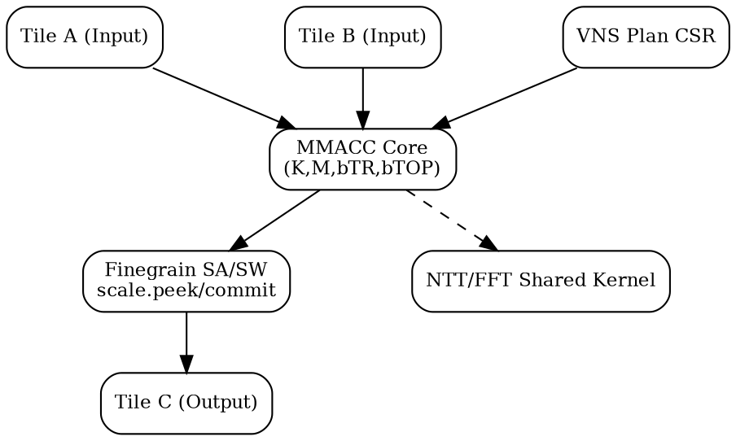

# XAME/VNS Multi-FFT Extension Spec v0.20 (EN)
*(Based on AME_MAC_Dataformat_profile_spec_v0.19 and X_AME_Finegrain_v0.18f)*

---
## 1. Overview

The X-AME/VNS (Extended Attached Matrix Extension / Vendor-specific Numeric Signal) architecture
extends the standard AME tile pipeline to directly map high-performance signal-processing workloads such as
multi-dimensional FFT, MIMO, and PQC NTT.

- **Base Structure:** `C = MMACC(A, B, K, M, bTR, RFmt, IFmt, bTOP [, bias_k])`
- **Target Domains:** 5G OFDM, mmWave Radar (4D FFT), PQC (FFT/NTT), and MIMO SVD/QR
- **Key Features:** Fine-grain scaling (SA/SW), peek/commit synchronization, CSR-managed FFT plans

---
## 2. Base Signature Structure

```text
C = MMACC(A, B, K, M, bTR, RFmt, IFmt, bTOP [, bias_k])
```

- **K:** Kernel type (FFT_BFLY, FFT_TWID, SHUFFLE, CGEMM_SM, GIVENS, LU_INV, etc.)
- **M:** Kernel metadata (radix, stage, stride, plan id, tw_base, etc.)
- **bTR:** Transform bits (bit-reverse, transpose, stride, etc.)
- **RFmt/IFmt:** Data format (FP16, INT16, SoA/AoS, etc.)
- **bTOP:** Tile operation mode (CONJ, SCALE_SHIFT, SATURATE, PLAN_SELECT, etc.)
- **bias_k:** Optional bias addition

---
## 3. Fine-Grain Scaling & SA/SW Pipeline Integration

The XAME/VNS architecture inherits the fine-grain scaling pipeline of X_AME_Finegrain_v0.18f.

```text
SA → scale.peek()
SW → scale.commit()
```
- Each FFT stage or MIMO block synchronizes scaling using `scale.commit()`.
- PQC NTT transformations reuse the same block-float mechanism.
- Per-stage shift bits are logged in `VNS_SCALE` CSR.

---
## 4. FFT / Radar / MIMO Examples

### (1) OFDM 4096-pt FFT
- 12-stage radix-4 butterfly
- Each stage: `K=FFT_BFLY`, `PLAN_SELECT=0`
- Twiddle factors broadcasted via `K=FFT_TWID`

### (2) 4-D Radar (256×128×128×128)
- Sequential FFT along Range/Doppler/Azimuth/Elevation axes
- Stride and transpose controlled by `bTR` field
- `SCALE_SHIFT=1`, `PLAN_SELECT=1` for real-time streaming pipeline

### (3) MIMO 4×4 SVD/QR
- Combination of Givens, Householder, and LU kernels
- Processes 16 complex elements per tile in batch mode

---
## 5. Unified PQC FFT/NTT Structure

The XAME/VNS defines a unified MMACC-based structure for PQC NTT (Falcon, Kyber, Dilithium).

| Transform | Kernel | Parameters |
|------------|---------|-------------|
| FFT | K=FFT_BFLY | radix, stage, tw_sel |
| NTT | K=NTT_BFLY | modulus, tw_sel, stage |
| INTT | K=INTT_BFLY | inverse twiddle |

FFT and NTT butterflies share the same tile pipeline, activated by `VNS_MODQ` CSR.

---
## 6. Extended CSRs

| CSR | Description |
|------|--------------|
| VNS_PLAN[n] | Plan descriptor (stage, radix, stride) |
| VNS_SCALE | Per-stage shift control |
| VNS_CPLX_FMT | Complex packing and endianness |
| VNS_LAYOUT | SoA↔AoS layout transform |
| VNS_STATUS | Stage progress and saturation flags |
| VNS_MODQ | Modular arithmetic enable for NTT |

---
## 7. Architecture Diagram



Source: TrustFarm XAME/VNS Research v0.20

---
## 8. Compatibility and Versioning

| Field | v0.19 | v0.20 Update |
|--------|--------|---------------|
| Signature | MMACC(A,B,K,M,bTR,RFmt,IFmt,bTOP[,bias_k]) | Same, K extended |
| Scaling | Fixed block shift | Fine-grain SA/SW-based |
| PQC | Not included | Unified FFT/NTT layer |
| CSR | 4 base | Added PLAN/STATUS/MODQ |
| Target | AME-only | XAME/VNS (Vendor-specific) |

---
*(End of Document)*
