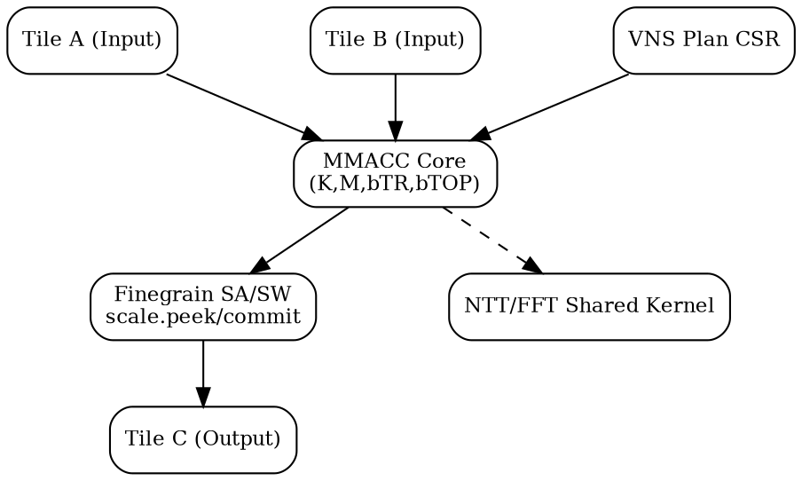

# XAME/VNS Multi-FFT Extension Spec v0.20 (KR)
*(확장 기반: AME_MAC_Dataformat_profile_spec_v0.19 + X_AME_Finegrain_v0.18f)*

---
## 1. 문서 개요

X-AME/VNS(Extended Attached Matrix Extension / Vendor-specific Numeric Signal) 구조는 기존 AME 타일 기반의 연산 파이프라인에
다차원 FFT, MIMO, PQC NTT 등의 고속 신호처리를 직접 매핑하기 위해 설계된 확장 규격이다.

- **기반 구조:** `C = MMACC(A, B, K, M, bTR, RFmt, IFmt, bTOP [, bias_k])`
- **적용 영역:** 5G OFDM, mmWave Radar(4D FFT), PQC(FFT/NTT), MIMO SVD/QR
- **추가 특징:** Fine-grain scaling (SA/SW), peek/commit 구조, CSR 기반 FFT plan 관리

---
## 2. 기본 시그니처 구조

```text
C = MMACC(A, B, K, M, bTR, RFmt, IFmt, bTOP [, bias_k])
```

- **K:** 커널 타입 (FFT_BFLY, FFT_TWID, SHUFFLE, CGEMM_SM, GIVENS, LU_INV 등)
- **M:** 세부 파라미터 (radix, stage, stride, plan id, tw_base 등)
- **bTR:** 변환비트 (bit-reverse, transpose, stride 등)
- **RFmt/IFmt:** 데이터 형식 및 포맷 (FP16, INT16, SoA/AoS)
- **bTOP:** 타일 연산 모드 (CONJ, SCALE_SHIFT, SATURATE, PLAN_SELECT 등)
- **bias_k:** 선택적 bias 적용

---
## 3. Fine-Grain Scaling & SA/SW 파이프라인 통합

XAME/VNS는 X_AME_Finegrain_v0.18f의 SA(SA_tile), SW(SW_tile) 기반 비동기 스케일 조정 구조를 그대로 계승한다.

```text
SA → scale.peek()
SW → scale.commit()
```
- 각 FFT 스테이지 혹은 MIMO 블록 연산마다 scale.commit()으로 동기화
- PQC NTT 변환에서도 동일한 block-float 구조 사용
- VNS_SCALE CSR에 stage별 shift 비트 기록

---
## 4. FFT / Radar / MIMO 확장 예시

### (1) OFDM 4096-pt FFT
- 12-stage radix-4 버터플라이
- 각 stage마다 `K=FFT_BFLY`, `PLAN_SELECT=0`
- twiddle은 `K=FFT_TWID`를 통해 브로드캐스트

### (2) 4-D Radar (256×128×128×128)
- Range / Doppler / Azimuth / Elevation 축별 FFT 순차 수행
- 각 축별 stride, transpose를 bTR 필드로 지정
- SCALE_SHIFT=1, PLAN_SELECT=1 로 실시간 파이프라인 운용

### (3) MIMO 4×4 SVD/QR
- Givens, Householder, LU 커널 조합
- batch 연산을 통해 16복소요소를 단일 타일에서 처리

---
## 5. PQC FFT/NTT 공용화 구조

XAME/VNS는 PQC NTT 변환(Falcon, Kyber, Dilithium)을 FFT 파이프라인과 동일한 MMACC 구조로 표현한다.

| 변환 | 대응 커널 | 파라미터 |
|------|-------------|-----------|
| FFT | K=FFT_BFLY | radix, stage, tw_sel |
| NTT | K=NTT_BFLY | modulus, tw_sel, stage |
| INTT | K=INTT_BFLY | inverse twiddle |

NTT의 butterfly와 FFT의 butterfly는 동일한 tile pipeline을 공유하며,
`VNS_MODQ` CSR로 모듈러 연산 활성화.

---
## 6. CSR 확장

| CSR | 설명 |
|------|------|
| VNS_PLAN[n] | plan descriptor (stage, radix, stride) |
| VNS_SCALE | stage별 shift 제어 |
| VNS_CPLX_FMT | 복소 패킹/엔디안 제어 |
| VNS_LAYOUT | SoA↔AoS 스와즐 변환 |
| VNS_STATUS | stage 진행률, 포화 플래그 |
| VNS_MODQ | NTT 모듈러 연산 활성화 |

---
## 7. 구조 다이어그램



출처: TrustFarm XAME/VNS 연구 v0.20

---
## 8. 호환성 및 버전 관리

| 항목 | v0.19 | v0.20 변화 |
|------|-------|-------------|
| Signature | MMACC(A,B,K,M,bTR,RFmt,IFmt,bTOP[,bias_k]) | 동일, K 확장 |
| Scaling | 고정 Block-Shift | Finegrain SA/SW 기반 |
| PQC | 비포함 | FFT/NTT 공용화 포함 |
| CSR | 기본 4종 | PLAN/STATUS/MODQ 추가 |
| 대상 | AME-only | XAME/VNS (Vendor-specific 확장) |

---
*(End of Document)*
