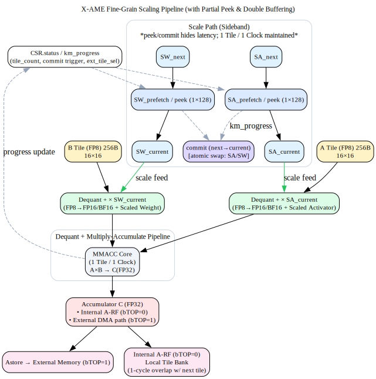

# X-AME Fine-Grain Scaling Pipeline (v0.18f)
**Title:** X-AME Finegrain Support (FP8 Scaled Activator & Weight with Partial Peek and Double Buffering)  
**Version:** v0.18f  
**Date:** 2025-10-10  
**Author:** TrustFarm / K.T. Ahn  

---

## 1. Overview
This document describes the *X-AME Fine-Grain Scaling Pipeline*, an optional extension under the AME framework.  
It introduces *scaled activator (SA)* and *scaled weight (SW)* sideband paths, enabling **fine-grained quantization** (1×128 activations, 128×128 weights) used in FP8 training and inference pipelines.

Key objectives:
- Maintain **1 Tile / 1 Clock** throughput.  
- Support **partial peek / double buffering** for SA/SW.  
- Integrate smoothly with `bTOP=0` (internal A‑RF) and `bTOP=1` (external DMA).

---

## 2. Motivation
In low‑precision training frameworks, FP8 offers high performance but limited dynamic range.  
The scaling of activations and weights on smaller granularities (e.g., 1×128, 128×128) helps mitigate overflow/underflow.

X‑AME adopts this concept while **preserving AME’s deterministic tile‑based throughput**.  
Instead of embedding scale logic into MAC tiles, SA/SW are fed via sideband pipelines using asynchronous peek/commit cycles.

---

## 3. Execution Flow

```
            ┌────────────────────────────────────────────────────────────┐
            │                    SCALE PATH (Sideband)                   │
            │ *peek/commit hides latency; 1 Tile / 1 Clock maintained.*  │
            │ ┌─────────┐  ┌─────────────┐           ┌────────────┐      │
            │ │ SA_next │─>│ SA_prefetch │─partial─> │ SA_current │──────┼──┐
CSR/DMA ──> │ │ SW_next │─>│ SW_prefetch │─peek   ─> │ SW_current │──────┼──┼──┐ 
            │ └─────────┘  └─────────────┘           └────────────┘      │  │  │
            │       ▲ commit          km progress, trigger     ▲         │  │  │
            │       │                      feedback ───────────┘         │  │  │ 
            └───────┼────────────────────────────────────────────────────┘  │  │ 
                    │                                                       │  │ 
                    ▼                                                       │  │ 
A Tile (FP8) ────────────────┐<─────────────────────────────────────────────┘  │
                             │                                                 │
                             ├───────> (FP8→FP16 Dequant)                      │ 
                             │       × SA_current(Scaled Activator)            │
                             │                                                 │
                             │                                                 │
                             │<────────────────────────────────────────────────┘
B Tile (FP8) ────────────────┤                                                          
                             ├───────> (FP8→FP16 Dequant)                
                             │         × SW_current (Scaled Weight) 
                             │                                                     
                             ▼
            ┌──────────────────────────────────────────────────────┐
            │   [ Dequant + Multiply-Accumulate Pipeline ]         │
            │   – A×B using current SA/SW scales                   │
            │   – 1 Tile / 1 Clock throughput maintained           │
            │   – Feedback: update km_progress, peek_next scales   │
            └──────────────────────────────────────────────────────┘
                             │
                             ▼
            ┌──────────────────────────────┐
            │  Accumulator (C, FP32)       │
            │  • Internal A-RF (bTOP=0)    │
            │  • External DMA path (bTOP=1)│
            └──────────────────────────────┘
                             │
                             ├─► Astore (bTOP=1) → External Memory 
                             │    
                             └─► Internal Acc (bTOP=0)
                                 Local A-RF Tile Bank 
```

**Graphical Dot Flow Diagram**


---

## 4. CSR Behavior
| CSR Register | Bits | Description |
|---------------|------|--------------|
| `CSR.mx.status` | [0] busy / [1] signal / [7:2] tile_count / [15:8] km_progress | Internal tracking of async operation |
| `CSR.ext_tile_sel` | – | External tile selector for DMA mode |
| `CSR.ext_tile_count[N]` | – | Parallel tile progress counter for bTOP=1 |
| `CSR.scale.commit` | – | Commit trigger for SA/SW atomic update |

---

## 5. Summary
- FP8 fine-grain scaling fits directly into AME’s tile-based MAC model.  
- SA/SW operate as **sideband metadata pipelines**, enabling future DeepGEMM/FP8 workflows.  
- No ISA opcode interference — scale ports are transparent to the MMACC ISA.  
- SoC vendors can extend via **VNS (VeNdor-Specific) AME extensions** for more complex FP8/BF16 hybrid scaling.

---

© 2025 TrustFarm AME Architecture Working Group
