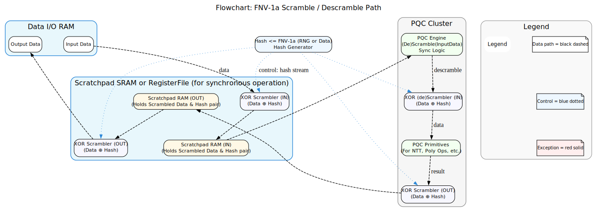

# PQC ISA — Security & Patchability Specification (Draft) v0.1 

---
[KO](PQC_ISA_security_patch_spec_v0_1_KR.md) | [EN](PQC_ISA_security_patch_spec_v0_1_EN.md) 
---

- Author: KyuTae Ahn (trustfarm.info@gmail.com, cpplover@trustfarm.net)  
- License: Apache-2.0, CC BY 4.0 (additional MIT for RISC-V/OpenRISC/OSS Security platforms)  
- History: Oct 01, 2025 — Draft v0.1 

---

## Purpose

This ISA proposal defines design criteria for extending RISC‑V with PQC (Post‑Quantum Cryptography) primitives and conventional crypto codecs (e.g., AES) while making **security (side‑channel resistance / constant‑time)** and **patchability** first‑class requirements. 

Using this document as the baseline, detailed work items 
  - instruction encodings, 
  - CSR lists, 
  - microcode model, 
  - compiler/toolchain mappings, 
  - RTL references, 
  - and SCA test plans

will be produced.

---

## 1. Abstract & Motivation

Mathematically secure PQC algorithms still open new side‑channels when implemented in embedded software, SSL libraries, and SoC platforms (timing, power/EM, cache ). Therefore, ISA‑level provisions must be present to:

- describe the security contract of each instruction (constant‑time, memory access constraints),
- provide **fail‑safe** mechanisms and the ability to **disable** or **mitigate** insecure features via firmware/microcode updates,
- supply verifiable reference models (Spike, RTL, tests) so proposals are actionable and auditable.

---

## 2. Security Scope & Threat Model & Tamper Resistance

**Scope:** PQC (Kyber / Dilithium / other lattice or hash-based primitives), symmetric codecs where applicable (e.g., AES pipelines), and supporting primitives (NTT, SHA3/Keccak, RNG).

**Threat model (abbreviated):**
- Adversary can observe timing, [cache behavior](#appendix-a--security-attack-summary--references-cachebleed), shared-memory side channels, and perform power/EM measurements in co-located scenarios.
- Adversary cannot decap the chip physically (out of scope for this ISA proposal).
- Goal: prevent leakage of secret keys/intermediates via micro-architectural side channels; permit safe, immediate mitigations when vulnerabilities are found.

Security goals prioritized here:
1. *Constant‑time semantics* for security-sensitive instructions.
2. *No secret‑dependent intra‑cache‑line offsets* (CacheBleed mitigation).
3. *Patchability* via signed microcode/firmware updates and CSR-controlled disable paths.
4. *Verifiability* — reference Spike model, RTL skeleton, test vectors, SCA harness.


❗  More detailed in 👉  [Appendix Security Threat Model](security_attack_appendix_EN.md)

**Tamper Attack and Resistance Model:** 
- Tamper resistance refers to design and manufacturing measures that increase the difficulty for an adversary to physically or electronically manipulate a device. Commonly described layers:

❗  More detailed in 👉 [Appendix Tamper Threat Model](tamper_appendix_EN.md)

---

### PQC Scramble / DeScramble DataPath Flowchart




## 3. Functional ISA Logic

Make Functional ISA logic , to resist Security Threat and Tamper Threat, adopt **`IO has scramble by simplehash`** and use `register file or scratchpad` to `CRYPTOENGINE`

> ```
> C_scrmb = CRYPTOENGINE (P_scrmb, K_scrmb, IV_scrmb, b_OP, b_scrmb, b_loadonscp, BlockWidth, TotalLength)
> ```
>   - **`CRYPTOENGINE`** directive will be replaced by **`PQC`** or **`AES`** et al


**Note:** `scrmb` means *scramble*.

Transparent scrambling prevents side‑channel timing attacks and cache (memory) bleed attacks.

**Optional very low‑cost and latency-less HW scramble implementations (examples):**
1. RNGIV — XOR streamed data with a hardware Random InitialVector stream.
2. Prime‑based simple hash (FNV‑1a variant) used as a scramble function. See: [**FNV-1A Hash**](https://en.wikipedia.org/wiki/Fowler%E2%80%93Noll%E2%80%93Vo_hash_function#FNV-1a_hash)
   - **FNV-1a Based [Ethash FNV-0](https://ethereum.org/developers/docs/consensus-mechanisms/pow/mining/mining-algorithms/ethash/#date-aggregation-function) Modification by trustfarm [TEthashV1 : EIP-1485](https://eips.ethereum.org/EIPS/eip-1485)
3. System clock based simple random generator used as scramble IV.

**Fields and flags (semantics):**
- `b_loadonscp` (1 bit): Load input data (Key, PlainText, IV) into ***scratchpad*** or immediate register buffer. 
    For streamed multi‑block data, use register file double buffering for pipelined operation.
- `C_scrmb` [O]: Output CipherText. If `b_scrmb` = 1, output is scrambled ciphertext; the ISA (or microcode) must descramble before writing to output memory. If `b_OP` = `01` (Decryption), it will store `PlainText_scrmb`.
- `P_scrmb` [I]: Input PlainText. If `b_scrmb` = 1, the input is scrambled and must be descrambled internally.
- `K_scrmb` [I]: Input KeyText. If `b_scrmb` = 1, the key is scrambled and must be descrambled internally.
- `IV_scrmb` [I]: Input IV (scramble IV or algorithm IV). `b_scrmb` flags do not alter IV behavior.
- `b_OP` [I]: Operation Mode (2 bits): `00` = Decryption, `01` = Encryption, `10` = Patch/Security (invoke mitigation), `11` = Reserved / Disable PQC block.
- `BlockWidth`: Block width (bits) — allowed: 128, 256, 512, 1024 (used for block ciphers and padded operations).
- `TotalLength`: Total data length (bytes).

---

### 3.1 Functional ISA primitives (required building blocks)

The **PQC** ISA must provide a small set of low‑level primitives that are constant‑time by contract and that higher‑level PQC algorithms map to. 

Example primitives (mnemonic names):

- `PQC.LOAD_LINE scratch, addr` — load an entire cache line to PQC scratch (avoids intra‑line leakage).
- `PQC.NTT.BF rd, rs1, rs2, twiddle_idx` — NTT butterfly primitive (modular add/sub/multiplication).
- `PQC.POLY.MUL_ACC rd, rs1, rs2` — polynomial multiplication accumulate primitive.
- `PQC.SHA3.XOF rd, rs1, rs2, len` — SHA3 / XOF absorb/extract primitive.
- `PQC.RNG_FILL dest, len` — hardware RNG fill into scratch region (with attestation).
- `PQC.MASK.LOAD shareptr, value` — load masked share(s) to masked register file.
- `PQC.MASK.OP op, dst, src1, src2` — mask‑aware arithmetic operations (optionally microcode supported).
- `PQC.MCODE.CALL idx` — call microcode mitigation routine at index `idx` (atomic, secure region).

All these primitives must carry explicit security contracts in the ISA (**constant‑time**, **no secret‑dependent intra‑line offsets**, etc.).

---

## 4. Mapping PQC Algorithms to Functional ISA Logic

Below are *function-style* ISA mappings for representative PQC algorithms.

Each mapping shows a high‑level function signature in the same style as the main `PQC(...)` kernel and enumerates the internal ISA primitives required. 
These should be used as canonical examples for WG proposals and PoC implementations.

### 4.1 Kyber (KEM) — high‑level operations

Kyber basic ops: `KeyGen()`, `Encaps(pk) -> ct, ss`, `Decaps(sk, ct) -> ss`

**ISA Function signatures (scramble-aware):**

```
# Key Generation (generates public key pk_scrmb, secret key sk_scrmb)
(PUBk_scrmb, SECk_scrmb) = PQC_KYBER_KEYGEN(K_seed_scrmb, IV_scrmb, b_scrmb, b_loadonscp, Params, TotalLength)
```

- **Inputs:**
  - `K_seed_scrmb`: seed for keygen (scrambled if `b_scrmb`=1).
  - `Params`: Kyber parameter set (k, q, n, etc).
- **Outputs:**
  - `PUBk_scrmb`: public key (optionally scrambled on readback).
  - `SECk_scrmb`: secret key stored in PQC secure scratch (masked if platform supports).


**Internal functional flow (mapped to primitives):**
1. RNG / seed expansion — `PQC.RNG_FILL scratch_seed, seed_len`
2. Matrix / poly generation — `PQC.SHA3.XOF ...` for expand; write twiddle tables to `pqc_scratch_base` using `PQC.LOAD_LINE` aligned writes.
3. NTT(Number Theoretic Transform)  domain transforms for polynomials — use `PQC.NTT.BF` and `PQC.POLY.MUL_ACC` primitives in pipelined loops; ensure masked arithmetic if `pqc_feat.MASKING_SUPPORTED`.
4. Pack and output `PUBk_scrmb` via microcode path that may apply `b_scrmb` encoding/descrambling.

```
# Encapsulation
(ct_scrmb, ss_scrmb) = PQC_KYBER_ENCAP(PUBk_scrmb, RNG_seed_scrmb, IV_scrmb, b_scrmb, b_loadonscp, Params, TotalLength)
```

**Internal steps:**
- Generate ephemeral seed: `PQC.RNG_FILL`
- Derive ephemeral key and message: `PQC.SHA3.XOF`
- Polynomial ops: NTT transforms, poly multiplication (`PQC.NTT.BF`, `PQC.POLY.MUL_ACC`)
- Rejection sampling / noise handling: constant‑time loops; avoid secret dependent indexing (use `PQC.LOAD_LINE` and access fixed sequences)
- Pack ciphertext `ct_scrmb`; if `b_scrmb`=1, microcode applies scramble before storing.

```
# Decapsulation
(ss_scrmb) = PQC_KYBER_DECAP(sk_scrmb, ct_scrmb, IV_scrmb, b_scrmb, b_loadonscp, Params, TotalLength)
```

**Notes & Security Requirements (Kyber):**
- NTT primitives must be constant‑time; ensure `PQC.NTT.BF` and `PQC.POLY.MUL_ACC` do not expose secret‑dependent memory offsets.
- Rejection sampling must be implemented as constant‑time or moved to safe microcode path.
- Masking: secret key material held masked in scratchpad when `pqc_feat.MASKING_SUPPORTED`.

---

## Glossary — Kyber (KEM) Abbreviations

- **pk** = **PUBk** : *Public Key*  
- **sk** = **SECK** : *Secret Key (Private Key)*  
- **ct** = **CIPHERT** : *Ciphertext*  
- **ss** = **SHRDS** : *Shared Secret*  
- **CSR** = **Control and Status Register** :
    *RISC-V architectural registers that store control and status information.*
    - *In PQC ISA, used for flags (pqc_feat, masking support, etc.) and microcode patch control.*
- **Constant-Time** : *Execution semantics where timing and memory access patterns do not depend on secret data (keys, messages).*
    - *Fundamental requirement for side-channel resistance.*
- **Masking** : *A countermeasure technique where sensitive values are split into multiple random shares.*
    - *Prevents single-trace leakage of secret values.*
    - *In PQC ISA: supported via `PQC.MASK.LOAD`, `PQC.MASK.OP`, with feature control bit `pqc_feat.MASKING_SUPPORTED`.*
- **Microcode Mitigation** : *A patch/mitigation path implemented in secure microcode, invoked by `PQC.MCODE.CALL` idx.*
    - *Allows immediate response to discovered vulnerabilities before a new silicon revision.*
- **Tamper Resistance** : *Design/manufacturing techniques that make it difficult for an attacker to physically probe, alter, or inject faults into the device.*
    - *Examples: protective coatings, voltage/temperature sensors, laser/probing detection.*

---

### Kyber Basic Operations

- **`KeyGen()`** → generates a keypair → returns *(PUBk, SECK)*  
- **`Encaps(PUBk)`** → encapsulates using the public key → returns *(CIPHERT, SHRDS)*  
- **`Decaps(SECK, CIPHERT)`** → decapsulates using the secret key → returns *(SHRDS)*  

---

### 4.2 Dilithium (CRYSTALS‑Dilithium) — signature scheme

Top level: `KeyGen(), Sign(sk, msg) -> sig, Verify(pk, msg, sig) -> ok`

**ISA Function signatures: KeyGen**

```
# KeyGen
(pk_scrmb, sk_scrmb) = PQC_DILITHIUM_KEYGEN(seed_scrmb, IV_scrmb, b_scrmb, b_loadonscp, Params, TotalLength)
```

**Sign:**

```
# Sign
(sig_scrmb) = PQC_DILITHIUM_SIGN(sk_scrmb, msg_scrmb, IV_scrmb, b_scrmb, b_loadonscp, Params, TotalLength)
```


**Verify:**
```
# Verify
(ok_flag) = PQC_DILITHIUM_VERIFY(pk_scrmb, msg_scrmb, sig_scrmb, IV_scrmb, b_scrmb, b_loadonscp, Params, TotalLength)
```

**Fields and Flags**
- INPUT:
- `pk_scrmb` : PublicKey (can scramble)
- `msg_scrmb` : Message (can scramble)
- `sig_scrmb` : Sign (can scramble)
- `IV_scrmb`, `b_scrmb`, `b_loadonscp`, `Params`, `TotalLength`
- OUTPUT:
  `ok_flag` (1 bit) : Verify success or not (1 = success, 0 = fail)


**Internal mapping (functional building blocks):**
1. Expand seed → matrix A via `PQC.SHA3.XOF`; store aligned.
2. Polynomial multiplications using NTT primitives `PQC.NTT.BF`, `PQC.POLY.MUL_ACC`.
3. Norm checks and rejection loops: must be constant‑time — enforce via microcode to serialize checks and avoid secret dependent branches.
4. Hash map to challenge (SHAKE/SHA3) → `PQC.SHA3.XOF`.
5. Pack signature, apply scramble if requested.

**Notes (Dilithium specifics):**
- Challenge generation (hash) uses message + randomness; the hashing primitive must be constant-time in its memory accesses.
- Norm/rejection checks require careful constant-time implementation or be moved to a microcode-managed safe path that preserves timing invariants visible to attacker.

---

### 4.3 SPHINCS+ (hash‑based signature family)

Top-level:

**Sign**
```
# Sign
(sig_scrmb) = PQC_SPHINCS_SIGN(sk_scrmb, msg_scrmb, IV_scrmb, b_scrmb, b_loadonscp, Params, TotalLength)
```

**Verify**
```
## Verify
(ok_flag) = PQC_SPHINCS_VERIFY(pk_scrmb, msg_scrmb, sig_scrmb, IV_scrmb, b_scrmb, b_loadonscp, Params, TotalLength)

```

**Fields and Flags**
- INPUT:
- `pk_scrmb` : PublicKey (can scramble)
- `msg_scrmb` : Message (can scramble)
- `sig_scrmb` : Sign (can scramble)
- `IV_scrmb`, `b_scrmb`, `b_loadonscp`, `Params`, `TotalLength`
- OUTPUT:
  `ok_flag` (1 bit) : Verify success or not (1 = success, 0 = fail)


**Internal mapping:**
- SPHINCS uses many hash operations (WOTS, FORS, hypertree). Map heavy hash usage to `PQC.SHA3.XOF`.
- Tree traversal & index-dependent operations: **critical** — avoid secret-dependent memory offsets when walking trees; always access fixed sets (use `PQC.LOAD_LINE` to read node blocks, or use masked indexing).
- Signature packing and randomness generation via `PQC.RNG_FILL`.

**Notes:**
- SPHINCS+ is hash‑heavy but has many index operations; must ensure tree index handling is not leaking via cache bank conflicts.

---

### 4.4 Other primitives (short list)
- **Lattice‑based primitives**: NTT heavy — map to `PQC.NTT.BF`, `PQC.POLY.MUL_ACC`.
- **Hash‑based**: map to `PQC.SHA3.XOF`, `PQC.SHA3.KECCAK`.
- **Code‑based / Multivariate**: typically less table‑indexing but map bulk ops to `PQC.POLY.*` or `PQC.MASK.*` ops as appropriate.
- **Symmetric ciphers (AES etc.)**: integrate via microcode or hardware AES engines; include `b_scrmb` handling for streaming modes.

---

## 5. Practical ISA usage examples

**Example: Kyber encapsulation (high‑level call)**
```
# assume pk stored in secure region; we request hardware acceleration and scrambling
(ct_scrmb, ss_scrmb) = PQC_KYBER_ENCAP(pk_addr, rnd_seed_addr, iv_addr, b_OP=01, b_scrmb=1, b_loadonscp=1, BlockWidth=256, TotalLength=... )
```

At decode time, microcode will:
- verify `pqc_feat` bits,
- load pk into scratchpad using `PQC.LOAD_LINE`,
- call NTT primitives in constant‑time loops,
- produce `ct_scrmb` and write to memory after microcode applies descrambling step or software applies it if configured.

---

## 6. Security & Patchability notes (recap)

- **No secret‑dependent intra‑cache‑line offsets**: This is mandatory in the functional semantics of each PQC primitive. Implementations must either use whole‑line loads (`PQC.LOAD_LINE`) or access all candidate offsets in a constant, deterministic order.
- **Microcode mitigations**: `pqc_mcode_hash` and microcode override table must be used to deploy fast mitigations (dummy accesses, serialization) until a hardware revision is available.
- **Masking and blinding**: High priority for secret storage and arithmetic; implement mask‑aware ALUs if `pqc_feat.MASKING_SUPPORTED`.
- **Fallback**: If hardware feature absent/disabled, use `libpqc_sw_fallback.a` (software) with known SCA guarantees.

---

## 7. Next steps (for your review & iteration)
1. Review these function signatures and mappings for Kyber, Dilithium, SPHINCS+. Edit parameters or flags you want changed.  
2. After your review, I will convert each functional signature into:
   - concrete instruction encodings / opcode maps (bit‑level),
   - microcode override examples (pseudocode),
   - Spike model handlers for the high‑level PQC functions.

---

## Appendix A — Security attack summary & references (CacheBleed)

- CacheBleed original paper: Yarom, Genkin, Heninger — "CacheBleed: A Timing Attack on OpenSSL Constant‑Time RSA"  
  Full URL: https://faculty.cc.gatech.edu/~genkin/cachebleed/cachebleed.pdf

(See the PoC package and SCA checklist for recommended CacheBleed test cases: victim NTT implementation, attacker bank‑conflict probe, measurement parameters.)

---
